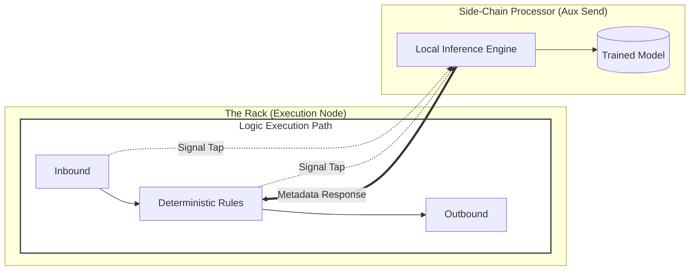

# AI and automation strategy

<!-- Copyright (c) 2026 JAAB Tech SAS, Uruguay All Rights Reserved -->
<!-- See https://jaab.tech -->

**fluxrig** leverages Artificial Intelligence to enhance engineering productivity and operational intelligence while adhering to a strict policy of **Determinism** and **Sovereign Security**. We treat AI as a high-fidelity augment to human engineering, not a replacement for deterministic business logic.

> [!IMPORTANT]
> **Forged by AI for AI**: **fluxrig** holds a unique heritage. The platform was engineered through human oversight augmented by deep agentic workflows, ensuring the architecture is optimized for both human readability and machine-assisted orchestration.

## The auxiliary signal processor

The platform treats Artificial Intelligence and Machine Learning as an **Auxiliary Signal Processor**, similar to how a professional audio mixer handles complex spectrum analysis or side-chain compression. This allows for deep operational insights without ever impacting the primary, high-performance "Dry Signal" (the transactional hot-path).

### The dry vs. wet signal boundary

In mission-critical environments (e.g., Financial Core or Industrial Control), probabilistic models cannot make autonomous, blocking decisions. We enforce a strict boundary:

1.  **The Dry Signal (Deterministic)**: The core execution engine always operates on hard-wired, deterministic rules. Every transaction must be 100% reproducible and explainable to regulators.
2.  **The Wet Signal (Probabilistic)**: AI processes a "Signal Tap" of the transaction data to provide behavior analysis, fraud scoring, and anomaly detection in a side-chain context.

---

## Side-chain inference

When a business process requires AI insights (e.g., Adaptive Risk Scoring), it operates via the **Side-Chain Inference** pattern. This is a non-blocking "Aux Send" that taps the signal, processes it in an isolated inference engine, and feeds the results back as metadata for subsequent processing cycles.

*   **Signal Isolation**: The primary transaction (the Dry Signal) flows through the Rack at wire-speed, unaffected by the compute-heavy inference engine.
*   **Adaptive Feedback**: Resultssuch as a risk scoreare attached to the signal metadata for the next transaction or can trigger an asynchronous compensating signal if a critical threshold is breached.

---

## Automation strategy: human-in-the-loop

**fluxrig** is designed as a headless engine that integrates with modern service orchestrators. While AI can suggest optimizations, such as a more efficient routing topology, all changes must pass through a strict **Human-in-the-Loop** gate before deployment.

*   **Generative Scenario Design**: Local AI can synthesize representative traffic patterns, allowing for high-fidelity simulation in the Verification Rig without exposing real production data.
*   **Agentic Workflows**: High-level business process automation (e.g., automated alerts or incident triage) happens in the central automation hub, isolated from the time-critical execution plane.

## Local anomaly and explainability (XAI)

Detection is only half the battle. Operators must understand the rationale behind a flagged signal. we prioritize **Explainable AI (XAI)** over opaque models.

*   **Edge Isolation Forests**: Used to detect outliers in high-volume traffic patterns before they impact the wider network.
*   **Reasoning Vectors**: Every scoring event provides a mathematical reasoning vector (e.g., `score: 0.9, rationale: 'unusual temporal cluster'`) for immediate auditability.

---

## Technology posture

| Strategy | Technology | Role |
| :--- | :--- | :--- |
| **Routing Rules** | Deterministic Matcher | Hot Path (Zero Hallucination) |
| **Anomaly Detection** | Tensor Runtimes | Side-Chain Scoring / Signal Tap |
| **Synthetic Data** | Generative Models | High-Fidelity Load Testing |
| **Scenario Assistant** | Small Language Model (SLM) | Documentation & Scenario Drafting |

> [!CAUTION]
> **Architectural Status**: While the architecture is AI-optimized, runtime features like Side-Chain Inference and local tensor runtimes are currently in the architectural research phase. The {{VERS}} release focuses on the deterministic foundation required to support these advanced capabilities.