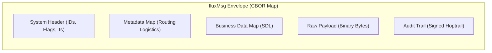

<!-- Copyright (c) 2026 JAAB Tech SAS, Uruguay All Rights Reserved -->
<!-- See https://jaab.tech -->

# Data architecture

The **fluxrig** data architecture is designed for extreme integrity and high-fidelity signal processing in mission-critical environments. Every signal in the rig is self-describing, bit-perfect, and audit-ready.

## The signal: `fluxMsg`

At the center of the ecosystem is the **`fluxMsg`**, a high-performance, structured representation of a transactional signal. It acts as a high-fidelity envelope carrying the raw payload and its associated operational context.

### Deterministic binary serialization

We use **Deterministic CBOR (RFC 8949)** as the project wire language. This provides the foundation for institutional data-plane trust:

1.  **Bit-Perfect Stability**: The same logical message results in an identical byte-for-byte signature, enabling reliable cryptographic verification.
2.  **Type Fidelity**: Field types are preserved throughout the signal path, eliminating ambiguity in financial and industrial calculations.
3.  **Payload Efficiency**: Native support for binary blobs allows the transport of legacy payloads (e.g., ISO8583 bitmaps) without encoding overhead.

### The `fluxMsg` structure

For the full technical specification of the `fluxMsg` fields, system flags, and wire-format requirements, see the **[Data Model Reference](../reference/data_model.md#fluxmsg-structure-payload)**.

---

## Technical identity model

To ensure data sovereignty and end-to-end auditability across thousands of distributed nodes, we implement a dual-track identity model.

### fluxID (Transactional tracer)
Every signal entering the rig is assigned a **`fluxID`**, a **128-bit, time-ordered unique identifier (UUID v7)**.

*   **Standard**: **RFC 9562 (UUID v7)**.
*   **Property**: Chronologically sortable (millisecond precision), globally unique, and optimized for native indexing in high-performance storage engines.
*   **Role**: The primary key for telemetry joins, distributed traces, and audit archives.

### fluxEntityID (Persistent component identity)
Components that require persistent identity (Racks, Gears, Scenarios) are assigned a **`fluxEntityID`**.

*   **Structure**: A 128-bit UUID v7 that embeds the **EntityType** and a **MachineID Hint** for stateless traceability.
*   **Role**: Provides immutable, human-interpretable identities for infrastructure components across their entire lifecycle.

---

## Schema governance

We strictly separate the **Tactical Structure** of a signal from its **Topological Path**.

### fluxSpec (Logical schema)
Defined via the **Spec Definition Language (SDL)**, these schemas define the structure of external protocols (e.g., "ISO8583 Dialects").

*   **Immutability**: Specs are stored in a **Content-Addressable Store (CAS)** using **SHA-256** hashing. Any modification generates a new hash, preventing silent failures in the distributed data-plane.
*   **Validation**: Every node in the fleet must re-verify the spec hash before executing logic on a new version.

### Scenarios (Topological blueprint)
The **Scenario** is the declarative blueprint of a pipeline. It defines the signal flow between Gears and is pushed as an immutable, signed artifact to the edge.

---

## Sovereign persistence strategy

Every Rack functions as an independent, **Sovereign Data Vault**, ensuring that signal integrity is maintained even during total cloud connectivity failure.

1.  **Immutable WAL**: Every signal passing through a Rack is recorded to a local, immutable **Write-Ahead Log (WAL)** using high-performance binary storage.
2.  **Non-Intrusive Signal Tap**: Observability telemetry (Metrics/Traces) is "tapped" from the main execution path. This data is uploaded asynchronously, ensuring that observability never introduces latency to the business hot-path.
3.  **Data Residency Sovereignty**: Detailed payloads (e.g., raw financial messages) can be configured to remain exclusively in the local edge vault while only high-level metadata reaches the central Mixer. 

> [!NOTE]
> **Privacy Roadmap**: Advanced features like **Edge Tokenization** and **Deterministic Field Masking** (where sensitive fields are scrubbed natively within the Gear runtime) are currently in the **v0.5.0 roadmap**. In the current release, masking should be managed via custom Gear logic or the **[Bento Gear](../reference/gears/bento.md)**.

---

## Technical references
*   **Wire Format**: See **[RFC 8949 (CBOR)](https://www.rfc-editor.org/rfc/rfc8949.html)**.
*   **SDL Reference**: See the **[ISO8583 SDL Guide](../reference/specs/iso8583_sdl.md)**.
*   **Storage Architecture**: See the **[Deployment Architecture](./deployment.md)**.