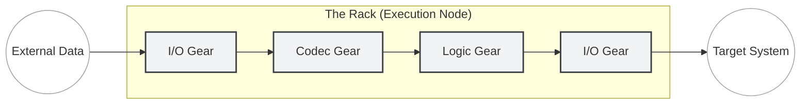

<!-- Copyright (c) 2026 JAAB Tech SAS, Uruguay All Rights Reserved -->
<!-- See https://jaab.tech -->

# Gear architecture

**Gears** are the modular logic units of the **fluxrig** ecosystem. They function as pluggable processing modules that can be chained together to form complex, low-latency data pipelines.

---

## Implementation models

The architecture categorizes Gears based on their performance profile, security boundary, and deployment lifecycle.

### Native gear (Static / High-performance)
*   **Role**: **Hardware Interfacing & System Access**.
*   **Use Case**: Low-level I/O (TCP/UDP sockets, Serial, File system) and logic requiring native CPU instructions for ultra-low latency.
*   **Implementation**: Written in **Go** and compiled directly into the **Rack** binary.
*   **Stability**: Offers the lowest possible overhead and absolute memory safety.

### Wasm gear (Pluggable / Agile)

> [!NOTE]
> **[Planned feature]**

*   **Role**: **Business Logic & Data Transformation**.
*   **Use Case**: Risk scoring, data normalization, protocol validation, and dynamic routing.
*   **Implementation**: Designed to execute **WebAssembly (Wasm)** via an embedded runtime.
*   **Capabilities**: Sandboxed execution and "hot-reloadable" logic without process reboots.

### Virtual gear (Remote / Centralized)
*   **Role**: **Global Orchestration**.
*   **Use Case**: Logic that runs within the **Mixer** but is connected to a localized pipeline via secure tunnels.
*   **Strategy**: Ideal for global registry lookups, long-running business workflows, or cross-cluster state synchronization.

---

## The port model

Communication between Gears is strictly governed by **Ports**, standardized entry and exit points that enforce data integrity.

### Port anatomy
Every Gear defines its interaction boundary via named ports:

1.  **Name**: Unique identifier (e.g., `in`, `out`, `err`).
2.  **Direction**: `Input` (Sink) or `Output` (Source).
3.  **Contract**: Defines the expected data format (e.g., `raw_bytes`, `parsed_payload`).

### Dynamic ports
Ports can be allocated at **Configuration Time** to support complex routing topologies.

*   **Array Mapping**: A configuration specifying `outputs: 3` will dynamically generate `out_0`, `out_1`, and `out_2`.
*   **Keyed Mapping**: A definition specifying `routes: [visa, amex]` will generate `out_visa` and `out_amex`.

> [!TIP]
> **Port Aliasing**: To improve architectural clarity, you can rename standard ports in your **Scenario** YAML (e.g., mapping `out` to `to_settlement_hub`).

---

## Execution modes: Active vs. Passive
 
 Gears operate in two primary execution modes depending on their role in the pipeline.
 
 ### Passive mode (Reactive)
 *   **Pattern**: **Consumer**.
 *   **Hook**: **`Process`**.
 *   **Behavior**: The gear remains idle until a message arrives via a **Wire**. It transforms or validates the data and returns a response.
 *   **Example**: A Codec Gear converting JSON to ISO8583.
 
 ### Active mode (Proactive)
 *   **Pattern**: **Source / Background Worker**.
 *   **Hook**: **`Start`**.
 *   **Behavior**: The gear spawns its own internal goroutines to execute logic continuously. It can inject messages into the pipeline using the `emit` function.
 *   **Example**: A TCP Listener accepting new connections, or a **Coat Check Daemon** monitoring TTL timeouts in the background.
 
 ---
 

## Gear lifecycle

To ensure deterministic behavior and simplified troubleshooting, Gears adhere to a standardized lifecycle contract managed by the Rack supervisor:

| Hook | Description |
| :--- | :--- |
| **`Init`** | Loads configuration, establishes internal service bindings via the **GearContext**, and registers observability metrics. |
| **`Start`** | Signals the gear to begin active operations (e.g., opening listener sockets or initializing Wasm sandboxes). |
| **`Process`** | The high-performance hot-path for processing incoming data, performing validation, and executing business logic. |
| **`Drain`** | Instructs the gear to complete pending transactions without accepting new input to prevent data loss. |
| **`Stop`** | Final graceful resource recovery, closing physical sockets and flushing remaining buffers. |

---

## Native observability

Gears are observable by default, with telemetry collected from the execution path:

*   **Non-Intrusive Tracing**: Every logic execution is automatically wrapped in an **OpenTelemetry span** without manual instrumentation.
*   **Performance Metrics**: Throughput (`mps`) and processing latency (`μs`) are exposed via the Rack's embedded exporter.
*   **Error Correlation**: Gear-level failures are captured and linked to the active `trace_id` for rapid root-cause analysis.