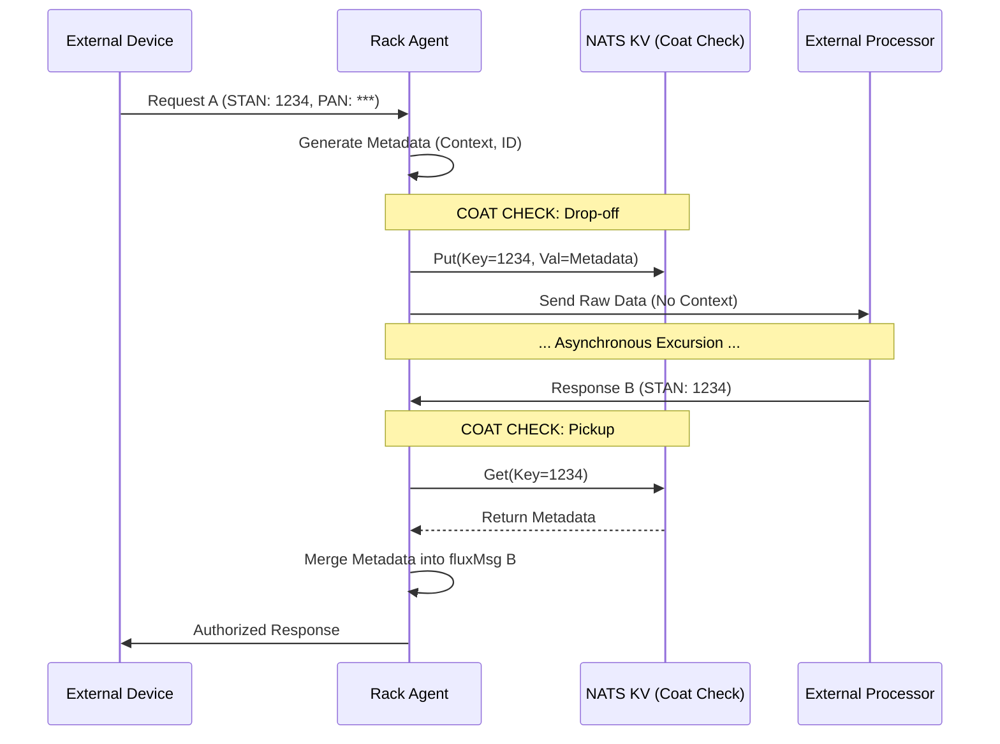

# Message flow and integrity

<!-- Copyright (c) 2026 JAAB Tech SAS, Uruguay All Rights Reserved -->
<!-- See https://jaab.tech -->

# Message flow and integrity

**fluxrig** is designed to ensure absolute data integrity and context persistence across asynchronous, stateless execution paths. This document defines how the platform maintains a continuous record of a message's lifecycle, even when it leaves the system to traverse external, untrusted networks.

## The challenge: asynchronous excursions

In a distributed processing pipeline, a **Request** and its **Response** are decoupled, asynchronous events.

*   **Request (`fluxMsg A`)**: Carries rich operational metadata (e.g., source context, session invariants, risk indicators).
*   **The Excursion**: The Rack emits the request to an external system (e.g., a banking network or industrial PLC) and immediately releases the thread to process subsequent messages. It does **not** block.
*   **Response (`fluxMsg B`)**: Arrives as a fresh message instance. By default, this returning message possesses no knowledge of the original request's context.

**The Goal**: To deterministically correlate the returning Response with its original Context, ensuring absolute auditability, compliance, and deterministic routing.

---

## Wire strategies

Not all data requires the same durability profile. **fluxrig** allows you to optimize the **Wire** per-flow based on the performance and durability requirements.

| Strategy | Transport | Durability | Latency (Typical) | Industry Use Case |
| :--- | :--- | :--- | :--- | :--- |
| **Standard** | **NATS JetStream** | **Durable** | **1 - 3ms** | High-Assurance Payments, Auditable IoT, Finality. |
| **Turbo** | **Go Channels**    | **Volatile** | **< 10µs**       | (Planned) Intranode High-Speed Logic. |

> [!WARNING]
> **Turbo Wires (Planned)**: Turbo Wires offer sub-millisecond performance by bypassing the NATS bus for local intra-rack flows. This strategy is currently in technical design and targeted for the **v0.5.0 milestone**.

---

## State management: metadata vs. coat check

To solve the context loss problem, **fluxrig** utilizes two distinct patterns depending on whether the data is within the trusted system mesh or crossing an external boundary.

### In-band Metadata (Intra-System Context)
When a message moves between Gears or Racks, it carries its context in-band via the **Metadata** map.

*   **Mechanism**: Key-value pairs stored directly in the `fluxMsg` envelope using [Deterministic CBOR (RFC 8949)](https://www.rfc-editor.org/rfc/rfc8949.html).
*   **Propagation**: The metadata travels with the message. When a Rack publishes to a durable stream, the entire envelope is persisted as a single atom of truth.
*   **Durability**: Guaranteed by the underlying transport layer with `At-Least-Once` delivery and high-availability retention.

### The Coat Check (Stateless Correlation)
When a message must leave the system to traverse an external network (e.g., raw TCP) that does not support the `fluxMsg` envelope, we implement the **Coat Check** pattern.

*   **The Drop-off**: Before the request exits the Rack, its metadata context is serialized and stored in a high-speed **NATS KV** store.
*   **The Ticket**: A unique identifier guaranteed to be returned by the external system (such as a Transaction Stand-in (STAN) or Retrieval Reference Number (RRN)) serves as the correlation key.
*   **The Pickup**: When the response message arrives, the Rack uses the "Ticket" to retrieve and re-attach the original metadata to the new `fluxMsg`, restoring the message's context and traceability.

> [!IMPORTANT]
> **Sovereign Security**: The Coat Check is the technical foundation for **Tokenization**. Sensitive data (like PANs) can be "checked in" at the localized Rack and never traverse the central management layer or external telemetry backends, significantly reducing compliance audit scope.

---

## The context lifecycle

The following sequence illustrates the **Coat Check** pattern during a typical asynchronous transaction excursion.

---

## Control plane signaling

Beyond business data, **fluxrig** maintains a dedicated, high-priority **Control Plane Signaling** hierarchy (`flux.ctrl.>`) for out-of-band management and safety triggers.

### Message types & patterns

| Signal | Subject Pattern | Description | Impact |
| :--- | :--- | :--- | :--- |
| **Kill Switch** | `flux.ctrl.kill.>` | Emergency cessation of Gear processing. | Immediately halts the target Gear's internal loops. |
| **Conn Close** | `flux.ctrl.close.>` | Orchestrated termination of an I/O transport. | Triggers a clean socket closure and resource release. |
| **Scenario Update** | `flux.ctrl.sync.>` | Pushing a new execution topology. | Initiates the [Hot-Reload Process](deployment.md#operational-lifecycle-hot-reload). |

### Security & delivery
*   **Order of Precedence**: Control messages always bypass the standard data-plane queues to ensure immediate execution, even if the primary business queues are saturated.

---

## Reliability: connectivity convergence
To achieve the **[Sovereign Continuity](deployment.md#sovereign-continuity)** objective, **fluxrig** implements a relentless connectivity handshake during every deployment and hot-reload.

### The Relentless Handshake
When a Rack starts or reloads a Scenario, it does not immediately activate the gear logic. Instead, it enters a **Convergence Phase**:

1.  **Sync Probes**: The Rack emits `FlagSyncProbe` messages (internal NATS control messages) across every defined Wire in the topology.
2.  **Propagation Loop**: These probes circulate through the NATS mesh every 500ms.
3.  **Finality Check**: The Rack waits until every path confirms it is "hot" and reachable across the distributed nodes.
4.  **Gear Activation**: Only after 100% convergence is confirmed are the business and protocol gears (e.g., ISO8583/Wasm) allowed to start processing real-world traffic.

> [!NOTE]
> This mechanism solves the **First-Message Loss** problem typically found in distributed messaging systems, where JetStream subjects may take milliseconds to propagate to all nodes after a topology change.

---

## Reliability: sagas and compensation messages

**fluxrig** treats failures as data rather than exceptions. This allows for the orchestration of complex, distributed transactions without fragile locks, prioritizing deterministic terminal states.

*   **Pattern: Optional Error Routing**: Gears *can* define a logical `.err` port for error handling. Note that this is a **Logic-Driven Pattern**: the engine provides the wiring infrastructure, but the individual Gear implementation must be coded to explicitly emit problematic data to the `.err` port upon failure.
*   **Saga Pattern**: This pattern enables the implementation of Sagas, where a failure at a specific node triggers a compensating message (e.g., a reversal or an automated alert) to restore the system to a clean terminal state.
*   **Finality Governance**: We enforce a policy where every message eventually reaches a "Success" or "Failure" state, ensuring the system remains self-healing, auditable, and compliant with institutional data standards.

> [!TIP]
> **Transport Abstraction**: By leveraging high-level messaging abstractions, **fluxrig** decouples business logic from the underlying NATS transport. This allows you to test complex Gear logic in-memory without a network server, ensuring technical validation during development.