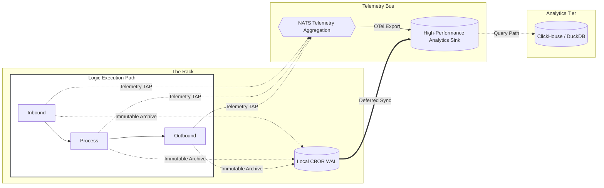

# Observability architecture

<!-- Copyright (c) 2026 JAAB Tech SAS, Uruguay All Rights Reserved -->
<!-- See https://jaab.tech -->

# Observability architecture

The **fluxrig** observability strategy is built on a non-intrusive model: **Native Telemetry Tapping**. Telemetry is tapped directly from the execution path and diverted for monitoring, tracing, and auditing without impacting the performance or integrity of the primary data flow.

## The zero-agent advantage

In contrast to running resource-heavy sidecars or agents alongside business logic, **fluxrig** embeds high-performance observability directly into its core binaries.

*   **Minimized Overhead**: By eliminating external agents, system resources (CPU/RAM) are reserved exclusively for data processing, critical for industrial IoT and secure gateway deployments.
*   **Unified Transport**: Telemetry, logs, and control signals are multiplexed over the existing secure tunnels, simplifying firewall complexity and reducing network overhead.
*   **W3C TraceContext**: **fluxrig** natively implements the **W3C TraceContext** standard, allowing it to participate in distributed traces started by upstream load balancers or client applications.

### Resource efficiency

| Metric | Industry Standard (Sidecar/Collector) | fluxrig (Embedded Tap) | Improvement |
| :--- | :--- | :--- | :--- |
| **Idle Memory (RSS)** | 250MB - 800MB | **< 25MB** | ~90% Reduction |
| **CPU (Idle)** | 3% - 5% | **< 0.1%** | Negligible |
| **Operational Surface** | Multi-process / Sidecar | **Single Binary** | Reduced Attack Surface |

---

## Operational telemetry (OpenTelemetry)

**fluxrig** achieves extreme visibility by generating three distinct telemetry types for every transaction, fully compliant with the **OpenTelemetry (OTel)** standard.

1.  **Traces**: Distributed spans following a request across the entire system.
2.  **Metrics**: High-fidelity performance histograms (latency, throughput, error rates).
3.  **Logs**: Structured, context-rich events attached directly to the transaction trace span for surgical root-cause analysis.

### Multi-dimensional correlation
To bridge the gap between business operations and technical troubleshooting, every event is correlated across three axes:

*   **`flux_id`**: The **Business Context** (The Transaction ID).
*   **`trace_id`**: The **Operational Context** (The OTel Trace ID).
*   **`entity_id`**: The **Source Context** (The specific Rack/Gear origin, utilizing UUID v7).

---

## Telemetry and autonomy

The system is designed to maintain 100% auditability even during network isolation.

---

## Traffic prioritization and backpressure

The **Transactional Hot-Path** (Business Logic) always takes absolute precedence over the **Telemetry Path** (Observability).

### Traffic prioritization
The Rack implements a multi-lane architecture to ensure telemetry never congests critical data processing.

| Lane | Content | Priority | Mechanism | Under Extreme Congestion |
| :--- | :--- | :--- | :--- | :--- |
| **Mission-Critical Lane** | Business Logic (`fluxMsg`) | **P0** | NATS JetStream | **Guaranteed**. |
| **Audit Lane** | Transaction Logs | **P1** | Local WAL | **Delayed, Never Lost**. |
| **Metric Lane** | Metrics & Debug Spans | **P2** | Buffer Management | **Dropped** if capacity exceeded. |

### The pressure chain (Fail-to-Local)

To protect the system during backend saturation or network isolation:

1.  **Backend Saturation**: If the central analytics sink becomes unreachable, the management layer signals backpressure.
2.  **Network Congestion**: The secure tunnel detects pressure and restricts ingestion.
3.  **Local Diversion**: The Rack automatically diverts telemetry from the network path to the **Local CBOR WAL**.
4.  **Resumption**: Once the pressure clears, the Rack trickles the archived WAL data back to the central sink using a rate-limited background worker.

---

## Compliance and governance

### Deterministic sanitization
Organizations can utilize deterministic masking to scrub sensitive information at the infrastructure boundary before data enters the persistent observability bus. This ensures that sensitive fields (like PANs) never reach the centralized telemetry backend, significantly reducing the audit scope of the central infrastructure.

> [!CAUTION]
> **Production Logging**: Enabling `DEBUG` or `TRACE` log levels may output raw hex payloads to the log stream. In production environments, ensure these levels are restricted to verify compliance with institutional "No Storage" security requirements.
