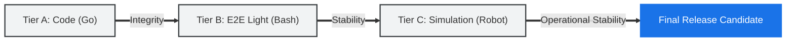

# Institutional verification and QA

**fluxrig** is engineered for institutional critical paths. Our Quality Assurance (QA) posture is based on the principle that "almost working" is an architectural failure. We employ a tiered, high-fidelity testing strategy that separates process reliability from business protocol accuracy, utilizing the platform as its own **Verification Suite**.

---

## Tiered assurance model
We maintain three distinct layers of validation to ensure system integrity, protocol compliance, and operational stability.

### Tier A: Core engineering (Go)
This layer validates the engine's internal integrity, focusing on the Go codebase.

*   **Unit & Integration**: Standard `go test`. Fast, isolated validation of codecs, ID generation, and package-level interactions.
*   **Fuzz Testing**: `go test -fuzz`. Mandatory for all native protocol Codecs (ISO 8583, Snake).
*   **Command**: `make test` (Minimum 60% coverage floor).

### Tier B: Accelerated E2E (Bash)
This layer uses a lightweight, high-speed Bash runner to perform system-level verification without the overhead of the full Robot environment.

*   **Regression Suite**: Discovers and executes isolated system scenarios (e.g., CLI, Telemetry, Registry).
*   **Sanity Bridge**: Used as the primary developer gate before moving to heavy simulations.
*   **Command**: `make regression`

### Tier C: Institutional simulation (Robot Framework)
This layer treats the entire platform as a single, assembled **Verification Suite**, focusing on protocol-heavy business scenarios.

*   **Protocol Integrity**: Uses the **[Automated verification with Robot Framework](../tutorials/iso8583_robot_suite.md)** tutorial patterns to simulate real-world hardware traffic across the Rack, Snake, and Mixer.
*   **Acceptance Scenarios**: Keyword-driven tests that fulfill "Definition of Done" for institutional clients.
*   **Command**: `make test-robot`

---

## Visualization: The Verification Suite Flow

---

## CI pipeline flow
Every Pull Request triggers a mandatory **Continuous Integration (CI)** pipeline to prevent regressions.

1.  **Static Validation**: Linting (`golangci-lint`) and Security Audits (`gosec`).
2.  **Core Validation**: Execution of the Tier A: Core Engineering suite.
3.  **Cross-Platform Build**: Verification that binaries compile for `linux/amd64`, `linux/arm64`, and `darwin/arm64`.
4.  **System Regression**: Execution of the full E2E suite via `make regression`.
5.  **Robot Validation**: Targeted execution of critical Robot Framework scenarios via `make test-robot`.

---

## Automated acceptance criteria (Gatekeepers)
In a "Hard Engineering" environment, a passing test suite is not just the absence of `FAIL`. Contributions must meet these quantitative thresholds to be eligible for merge:

1.  **Latency SLA (P99 < 5ms)**: Core data-plane operations (Gears/Snake) must maintain a **P99 latency < 5ms** under baseline load. Latency is measured using high-precision **HDRHistograms** to ensure outliers are captured without statistical drift.
2.  **Zero-Allocation Invariants**: Performance-critical message serialization paths must be **zero-allocation** (verified via `go test -benchmem`).
3.  **Bit-for-Bit Trace Integrity**: 100% bit-for-bit checksum validation on processed signals (mTLS Ingress to WAL Archive).
4.  **Security Posture**: Zero `HIGH` or `CRITICAL` findings in **Gosec** and **Govulncheck**.

> [!IMPORTANT]
> **Performance Regressions**: Any PR that causes a >10% regression in P99 latency is considered a breaking change and requires an architectural waiver.

---

## High-fidelity load generation
We use the native **[iso8583-tool](../reference/tools/iso8583_tool.md)** to simulate real-world transaction patterns against the **Data Plane**.

*   **Mode**: Load / Stress / Latency-Injection.
*   **Metrics**: High-precision RTT (Round Trip Time) tracking and SLA compliance reporting using HDRHistograms.
*   **Path Verification**: Every load test automatically validates the signal path from native ingress to the local DuckDB persistence layer.