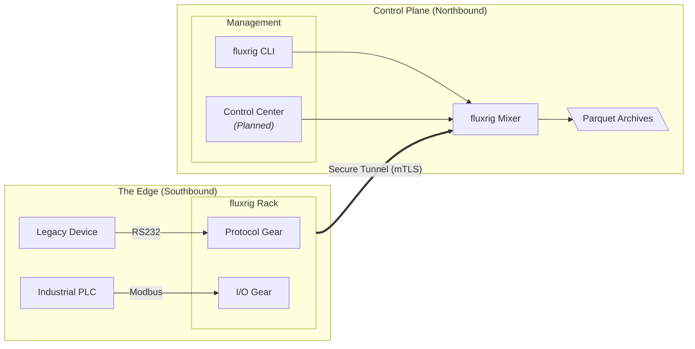

# fluxrig

**fluxrig** is a high-performance connectivity and protocol orchestration platform for distributed mission-critical infrastructure.

It provides a unified control plane to route, transform, and monitor data streams across heterogeneous environments (from industrial IoT sensors to global payment networks). **fluxrig** transforms complex, siloed technical debt into a standardized, configuration-driven data flow.

> [!TIP]
> Looking for a quick start? Check out the **[5-Minute Quickstart](./tutorials/quickstart.md)**! You can also read the **[Architecture Overview](./architecture/overview.md)** or explore our **[Industry Use Cases](./use_cases/index.md)**.

---

## Why fluxrig?

fluxrig is designed for environments where data integrity and edge autonomy are non-negotiable.

1. **Edge-to-Cloud Orchestration**: Manage thousands of distributed nodes as a single cohesive system.
2. **Protocol Agnostic**: Native support for ISO8583, JSON, Protobuf, and legacy binary protocols.
3. **Configuration over Code**: Deploy complex routing and transformation logic via declarative YAML: no custom coding required for standard integrations.
4. **Sovereign Autonomy**: Edge nodes operate independently, ensuring business continuity even during backhaul outages.

### Design philosophy: The professional audio logic

We borrow our architectural nomenclature from professional audio engineering to describe complex data flows with both precision and scale:

*   **The Gear**: A modular unit of logic (e.g., an ISO8583 codec or a Modbus adapter).
*   **The Rack**: An edge node that hosts and executes multiple Gears (like a stage rack).
*   **The Mixer**: The central Front of House (FOH) control plane that manages the fleet and aggregates telemetry.

> **[Read more about the professional audio logic →](./overview/philosophy.md)**

---

## Technical Architecture

### Core Entities

| Entity | Technical Role | Analogy |
| :--- | :--- | :--- |
| **Mixer** | Central control plane and entity registry. | Mixing Console |
| **Rack** | Distributed edge node executing local logic. | Equipment Rack |
| **Gear** | Modular functional unit (Native or Wasm). | Effect Pedal |
| **Wire** | Persistent, ordered message queue (NATS). | Signal Path |
| **Snake** | Secure, multiplexed mTLS tunnel. | Audio Snake |
| **fluxMsg** | Standardized internal data structure (CBOR). | High-Fi Signal |

---

## Choose your journey

### For Operators & SREs
**Maintain maximum uptime** and operational visibility. fluxrig provides the tools to orchestrate distributed racks, manage immutable snapshots, and analyze high-fidelity telemetry in real-time.

*   **[Deployment architecture & binaries →](./architecture/deployment.md)**
*   **[Operations & CLI reference →](./reference/cli.md)**
*   **[Technical configuration (Mixer/Rack) →](./reference/configuration.md)**
*   **[Telemetry & analytics guide →](./reference/telemetry_analytics.md)**

### For Developers & SDK Users
**Build specialized processing logic** with minimal overhead. Leverage the Native Go SDK to create custom protocol drivers or use the declarative Bento Gear for high-speed message transformation.

*   **[Writing your first Native Gear →](./tutorials/writing_gears.md)**
*   **[SDK reference & contract →](./reference/sdk.md)**
*   **[Bento Gear declarative logic →](./reference/gears/bento.md)**
*   **[Gears ecosystem reference →](./reference/gears/index.md)**

### For Architects & Security Teams
**Design resilient, sovereign data planes.** fluxrig allows for the design of complex, multi-actor topologies that enforce strict data isolation, zero-trust connectivity, and deterministic execution.

*   **[System foundation & core principles →](./overview/foundation.md)**
*   **[Security & identity architecture →](./architecture/security.md)**
*   **[Network & message flow integrity →](./architecture/message_flow.md)**
*   **[Industry use case spectrums →](./use_cases/index.md)**

---

  <a href="https://fluxrig.org">fluxrig</a> is made with ❤️ in Uruguay 🇺🇾 by <a href="https://jaab.tech">JAAB Tech</a>
    
  <a href="https://jaab.tech" style={ { display: 'block', margin: '20px auto', textAlign: 'center' } }>
    

      
    

  </a>

