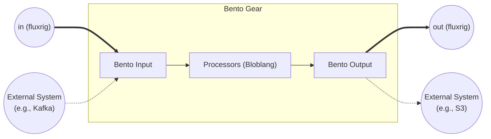

# Bento gear

The `bento` gear integrates the **Bento** engine (MIT Fork) into `fluxrig`. In the current release, it provides high-performance data mapping and logic via **[Bloblang](https://warpstreamlabs.github.io/bento/docs/guides/bloblang/about)** and **Standard I/O** (Files, Stdout). 

> [!NOTE]
> **Connector Status**: While the Bento ecosystem supports 100+ connectors, the standard `fluxrig` binary currently includes the **Pure Logic** and **Local I/O** sets to maintain a lightweight footprint. **Institutional Connectors** (Kafka, SQL, AWS, etc.) are currently in the **future roadmap** or can be enabled via a custom binary build.

| Attribute | Details |
| :--- | :--- |
| **Type** | `bento` |
| **Category** | I/O gears |
| **Status** | Stable |
| **Source Code** | [pkg/gears/native/bento](https://github.com/jaab-tech/fluxrig/tree/main/pkg/gears/native/bento) |
| **Pairs With** | N/A (Universal Bridging) |
| **Port IN** | Arbitrary `fluxMsg` |
| **Port IN Cardinality** | Multiple |
| **Port OUT** | Arbitrary `fluxMsg` |
| **Port OUT Cardinality** | Multiple |
| **Always Emitted Metadata** | None (Inherits from Bento config) |
| **Conditionally Emitted Metadata** | None |
| **Mandatory Consumed Metadata** | None |
| **Optional Consumed Metadata** | None |
| **Signals Sent** | None |
| **Signals Subscribed** | None |

## Architecture



## Configuration

| Field | Type | Required | Description |
| :--- | :--- | :--- | :--- |
| `bento` | `map` | **Yes** | The native Bento YAML configuration object. |
| `log_level` | `string` | No | Override log level (`TRACE`, `DEBUG`, `INFO`) for this gear. |

## Configuration safety
> [!IMPORTANT]
> **Strict Validation**: The Rack performs a "Dry Run" build of the Bento stream during startup. If your configuration is invalid (e.g., syntax errors, unknown plugins), the **Rack will fail to start**. This ensures strictly valid configurations in production.

## Description

The Gear automatically bridges `fluxrig` and Bento based on your `ports` definition. It attempts to **inject the missing side** of the pipeline:

1.  **Ingress (`fluxrig` -> Bento)**:
    *   If `ports.inputs` are defined, the gear **injects** a `flux_in_<gearname>` input source into the Bento config.
    *   *Note: Auto-wiring currently only supports the primary (first) input. Multiple inputs require manual broker configuration.*

2.  **Egress (Bento -> `fluxrig`)**:
    *   If `ports.outputs` are defined and **no Bento output is provided**, the gear **injects** a `flux_out_<gearname>` output sink.
    *   If you define a complex `bento.output` (e.g., a `switch` for routing), you must manually target the `flux_out_<gearname>` plugin for internal ports.

## Examples

### Source (local input)
Ingest from a local File -> Output to `fluxrig` `out`.

```yaml

- name: "file-ingest"
  type: "bento"
  ports:
    outputs: ["out"]
  config:
    bento:
      input:
        file:
          paths: ["/data/ingress/*.json"]
```

### Sink (local output)
Input from `fluxrig` `in` -> Egress to local storage.

```yaml

- name: "local-archive"
  type: "bento"
  ports:
    inputs: ["in"]
  config:
    bento:
      output:
        file:
          path: "/data/archive/${! meta(\"trace_id\") }.json"
```

### Processor (logic)
Transformation. `fluxrig` `in` -> Logic -> `fluxrig` `out`.

```yaml

- name: "pii-masker"
  type: "bento"
  ports:
    inputs: ["in"]
    outputs: ["out"]
  config:
    bento:
      pipeline:
        processors:

          - mapping: 'root = this; root.credit_card = "*****"'
```

### Router (traffic control)
Routes to different internal ports. You must configure the `switch` output.

```yaml

- name: "priority-router"
  type: "bento"
  ports:
    inputs: ["in"]
    outputs: ["high", "low"]
  config:
    bento:
      # Manually wire the output switch to specific `fluxrig` ports
      output:
        switch:
          cases:

            - check: 'this.priority == "high"'
              output:
                 flux_out_priority_router: { name: "high" }

            - check: 'this.priority == "low"'
              output:
                 flux_out_priority_router: { name: "low" }
```

### Aggregator (fan-in)
Merges multiple `fluxrig` streams (`app_logs`, `sys_logs`) into one output (`out`).

```yaml

- name: "concentrator"
  type: "bento"
  ports:
    inputs: ["app_logs", "sys_logs"] # Auto-wire takes primary (app_logs). Manual intervention recommended for multi-input.
    outputs: ["out"]
  config:
    bento:
      # No bento config needed; wrapper handles Input Broker -> default Pipeline -> Output Sink
```

## Rationale & extended info

### Native compilation (zero dependency)
The `bento` gear runs an **Isolated Bento Environment** compiled natively into the `fluxrig` binary. It does **not** rely on a separate sidecar container, external daemon, or network Hop. It bridges data between `fluxrig`'s internal NATS bus (CBOR) and Bento's internal message format using high-performance, in-memory channels.

### Data mapping (`fluxMsg` ↔ Bento part)
When data crosses the boundary between `fluxrig` and Bento, an automatic translation occurs:

*   **Ingress (`fluxMsg` -> Bento)**: The `fluxMsg.RawPayload` becomes the Bento message payload (accessible via Bloblang `this`). The `fluxMsg.Metadata` map becomes the Bento message metadata (accessible via Bloblang `meta("key")`).
*   **Egress (Bento -> `fluxMsg`)**: The Bento payload becomes the `fluxMsg.RawPayload`. The Bento metadata becomes the `fluxMsg.Metadata`.

### Error handling & routing
If a Bento processor (e.g., Bloblang mapping) fails gracefully, it typically uses Bento's standard error handling mechanisms.
However, to interface with `fluxrig`'s structured paths, you can leverage Bento's `switch` output or `try` processors to conditionally route failed messages back to specific internal `fluxrig` ports (e.g., `ports: { outputs: ["out", "error"] }`).

### Observability integration
Bento's native metrics and tracing subsystems are **bridged** to fluxrig's OpenTelemetry pipeline. When the gear starts, it registers a metrics bridge that exports Bento-internal counters and latencies (e.g., connector pressure, processor timing) as native OTel metrics.
