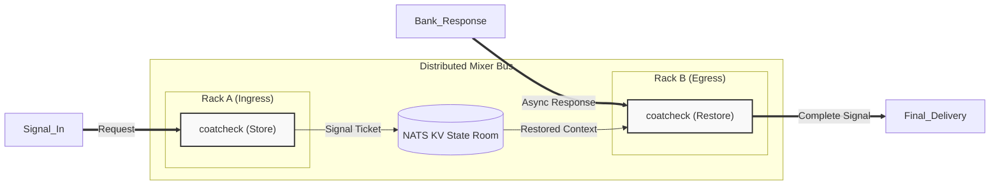

<!-- Copyright (c) 2026 JAAB Tech SAS, Uruguay All Rights Reserved -->
<!-- See https://jaab.tech -->

# Coat Check Gear

The `coatcheck` gear functions as the **Asymmetric Bus Driver** of the fluxrig mixer. It implements a high-speed **Context Correlation** engine that allows the system to remain stateless at the edge while preserving complex transaction context (session IDs, PCI tokens, tracing headers) across asynchronous boundaries.

By "Checking in" session state to a distributed cache, **fluxrig** resolves the **[Asymmetric Bus Scaling](../../use_cases/payments.md#the-payment-orchestration-spectrum)** problem, enabling horizontal scalability where requests can exit via one Rack and responses can return via another.

| Attribute | Details |
| :--- | :--- |
| **Type** | `coatcheck` |
| **Analogy** | **State Cache / Patch Memory** |
| **Status** | Stable |
| **Source Code** | [pkg/gears/native/coatcheck](https://github.com/jaab-tech/fluxrig/tree/main/pkg/gears/native/coatcheck) |
| **Tech Stack** | **[NATS JetStream (KV)](../../architecture/overview.md#transaction-flow-strategy-two-speed)** |
| **Pattern** | **[Claim Check](https://www.enterpriseintegrationpatterns.com/patterns/messaging/StoreInLibrary.html)** EIP |
| **Port IN** | Arbitrary fluxMsg |
| **Port IN Cardinality** | Single |
| **Port OUT** | Arbitrary fluxMsg |
| **Port OUT Cardinality** | Multiple (`out`, `error`) |
| **Mandatory Consumed Metadata**| `[key_fields]` (The Ticket) |
| **Optional Consumed Metadata** | `meta.coatcheck.ttl` |
| **Signals Sent** | `flux.event.timeout` (Metadata type) |

---

## Architectural Signal Path

In **fluxrig**, the "Coat Check" is a virtual state room shared across the entire mesh. It uses the **[Message Flow Architecture](../../architecture/message_flow.md)** to decouple identity from transport.

---

## Operational Modes

The gear behaves as a specialized processor depending on its configured `mode`:

### Mode: store (Check-In)
**Role**: Saves context before sending a message to a stateless transport.
1. Extracts `key_fields` (Correlation Key) and `value_fields` (Context Blob).
2. **Key Generation**: The extracted key fields are joined and encoded using **URL-Safe Base64** (`base64.RawURLEncoding`).
3. Saves the blob to the persistent NATS KV `bucket` with a `ttl`.
4. Forwards the original message unmodified to the `out` port.

### Mode: restore (Check-Out)
**Role**: Re-attaches context to a response coming back from a stateless transport.
1. Extracts `key_fields` from the response.
2. Lookups the Context Blob in the KV Store.
3. **Found**: Merges context into message metadata and forwards to `out`.
4. **Missing**: Applies `on_missing` logic (error/drop/forward).

### Mode: daemon (Governance)
**Role**: **Bucket Governance** & Timeout Detection.
This is a **Singleton** virtual gear managed by the Mixer. Only one instance runs globally per bucket to ensure no split-brain sweeping for expired TTLs.

1. **Governance**: Responsible for creating and configuring the bucket (storage type, replicas).
2. **Monitoring**: Detects expired keys and emits `flux.event.timeout.{bucket}` events to the Control Plane.

---

## Configuration Summary

The strategy follow the **[Air-Gap First](../../architecture/overview.md#system-components)** philosophy, using embedded NATS for zero-dependency state.

| Field | Type | Description | Default |
| :--- | :--- | :--- | :--- |
| **`mode`** | `string` | `"store"`, `"restore"`, or `"daemon"`. | - |
| **`bucket`** | `string` | The NATS KV bucket name. | - |
| **`key_fields`** | `[]string` | Fields used to build the deterministic correlation key. | - |
| **`value_fields`**| `[]string` | Fields stored as context (e.g., `["meta", "data.body"]`).| - |
| **`default_ttl`** | `duration` | Time until a Ticket expires (e.g., `1m`, `5s`). | `1m` |
| **`max_ttl`**     | `duration` | Safety cap for TTLs (Daemon Governance). | `5m` |
| **`on_missing`**  | `string` | Restore strategy: `"error"`, `"drop"`, `"forward"`.| `"error"` |
| **`merge_strategy`**| `string`| How to re-attach context: `"merge"` (default) or `"replace"`. | `"merge"` |
| **`storage`**     | `string` | NATS Storage: `"file"` or `"memory"`. | `"file"` |
| **`replicas`**    | `int`    | NATS KA replication factor (usually `1` or `3`). | `1` |
| **`include_values`**| `bool` | If true, timeout events contain the expired data. | `false` |

> [!IMPORTANT]
> **Singleton Governance**: You must always define one `mode: daemon` gear for every bucket. The fluxrig runtime will refuse to start if this dependency is missing, as it is critical for reaping expired tickets and avoiding storage leaks.

> [!TIP]
> **TTL Overrides**: You can dynamically override the `default_ttl` per-message by setting the `meta.coatcheck.ttl` metadata field (e.g., in a logic gear or via mapping) before checking in. This override is capped by the Gear's `max_ttl`.

### Use Case: Asymmetric Scaling (Active Payment Mixer)
In a high-scale financial environment, a Load Balancer (LB) distributes incoming TCP connections across a cluster of Racks. The **Asymmetric Bus** enables true active/active topologies where a request can exit via **Rack A**, and the response can arrive at **Rack B**. Rack B simply "Checks out" the original `conn_id` from the shared state room and routes the response back to the originator without requiring any local session state.
