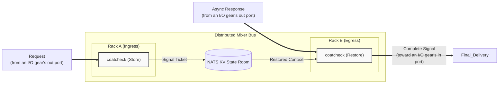

<!-- Copyright (c) 2026 JAAB Tech SAS, Uruguay All Rights Reserved -->
<!-- See https://jaab.tech -->

# Coat Check Gear

The `coatcheck` gear functions as the Asymmetric Bus Driver of the fluxrig mixer. It implements a high-speed context-correlation engine that allows the system to remain stateless at the edge while preserving complex transaction context (session IDs, tracing headers, and correlation metadata) across asynchronous boundaries.

By "Checking in" session state to a distributed cache, fluxrig resolves the [Asymmetric Bus Scaling](../../use_cases/payments.md#operational-patterns) problem, enabling horizontal scalability where requests can exit via one Rack and responses can return via another.

> [!NOTE]
> **Parking, not tokenization.** The Coat Check parks a value and restores the same value on the reply. It does not substitute a surrogate: tokenization (replacing a PAN with a vault-backed surrogate) is a separate gear on the roadmap. For a payment switch, the PAN must reach the scheme to authorize, so it is not parked on the primary path.

> [!NOTE]
> The [Conductor gear](conductor.md) generalizes the Coat Check pattern: it keeps this correlation engine (as a "valet" ticket store) and adds connection routing and reply matching, with a pluggable, local-by-default ticket store. Both gears ship: reach for the Conductor when you need switching, and stay with the Coat Check when single-leg field parking is enough (it also runs in the lean `-tags nobento` Rack).

| Attribute | Details |
| :--- | :--- |
| **Analogy** | **State Cache / Patch Memory** |
| **Source Code** | [pkg/gears/native/coatcheck](https://github.com/jaab-tech/fluxrig/tree/main/pkg/gears/native/coatcheck) |
| **Tech Stack** | **[NATS JetStream (KV)](../../architecture/overview.md#transaction-flow-strategy-two-speed)** |
| **Pattern** | **[Claim Check](https://www.enterpriseintegrationpatterns.com/patterns/messaging/StoreInLibrary.html)** EIP |
| **Mandatory Consumed Metadata**| `[key_fields]` (The Ticket) |
| **Optional Consumed Metadata** | `meta.coatcheck.ttl` |
| **Signals Sent** | `flux.event.timeout` (Metadata type) |

---

## Reference

The identity, ports, and configuration below are generated from the gear's manifest, so they stay in lockstep with the code.

<!-- AUTOGEN:manifest:coatcheck START (generated by `fluxrig gears doc coatcheck`; do not edit by hand) -->
| | |
|---|---|
| **Type** | `coatcheck` |
| **Category** | logic |
| **Status** | stable |
| **Terminus** | opaque |

Sessionless context correlation: parks fields under a key on store, restores them on the matching reply.

**Ports**

| Port | Direction | Role | Summary |
|---|---|---|---|
| `in` | input | message | Message to check in (store) or check out (restore). |
| `out` | output | message | Forwarded message. |
| `error` | output | error | Restore misses under the configured on_missing policy. |

**Configuration**

| Field | Type | Required | Default | Description |
|---|---|---|---|---|
| `bucket` | string | yes | - | NATS KV bucket that holds the parked context. |
| `mode` | enum: `store`, `restore`, `daemon` | yes | - | store parks fields under the key; restore reattaches them on the matching reply; daemon governs a bucket's TTL. |
| `await_store` | boolean |  | `true` | store mode: whether the message waits for the entry to be written. True when the reply depends on it (a stripped field that must be reattached). False when the entry only enriches a record, so a slow control plane cannot hold or fail the message; a failed write is logged and the entry is lost. |
| `default_ttl` | string |  | `1m` | how long a parked entry lives before expiry, e.g. '30s'. |
| `include_values` | boolean |  | `false` | daemon mode: read entry values (needed to honor per-message TTL overrides). |
| `key_fields` | array |  | - | message fields whose values form the correlation key. |
| `key_normalize` | enum: `trim`, `numeric`, `none` |  | `trim` | how key field values are canonicalized before joining: trim removes surrounding whitespace; numeric also drops leading zeros so fixed-width fields agree across differing specs; none joins them exactly as rendered. |
| `max_ttl` | string |  | `5m` | daemon mode: safety cap on any per-message TTL override. |
| `merge_strategy` | string |  | - | restore mode: overwrite replaces existing metadata; any other value preserves it. |
| `on_missing` | enum: `error`, `drop`, `forward` |  | - | restore mode: what to do when no entry is found (expired/never stored): error, drop, or forward without context. |
| `replicas` | integer |  | - | daemon mode: KV bucket replica count. |
| `storage` | enum: `file`, `memory` |  | - | bucket backing store: file (durable) or memory. |
| `store_timeout` | string |  | `5s` | store mode with await_store=false: how long the detached write may take before it is abandoned. |
| `value_fields` | array |  | - | store mode: fields (or meta.*) to park under the key and restore later. |
<!-- AUTOGEN:manifest:coatcheck END -->

## A bucket needs an owner

A `store` and a `restore` are not enough on their own. The bucket they use is not created on demand, because expiring entries needs a single owner rather than every Rack sweeping the same keys, so a third instance in `daemon` mode declares the bucket and governs its TTL.

Deploy it once per bucket. Without it the first `store` fails with `bucket not found`.

```yaml
- name: "in-flight-daemon"
  type: "coatcheck"
  config:
    mode: "daemon"
    bucket: "auth_in_flight"
    storage: "memory"
    replicas: 1
    default_ttl: "30s"
```

## Seen in use

[Enriching an authorization with a network signal](../../tutorials/roaming_enrichment.md) uses a store/restore pair to measure an authorizer's round trip, and covers the two things that fail quietly there: the key has to be rendered the same way on both sides (`key_normalize`), and the restore has to overwrite rather than preserve, or the reply is routed back into the wrong connection.

## Architectural Signal Path

In fluxrig, the "Coat Check" is a virtual state room shared across the mesh: this gear always backs its tickets with a NATS KV `bucket`, which is what enables the Asymmetric Bus (any Rack can check out a ticket another Rack checked in). The [Conductor](conductor.md) generalizes this with a pluggable, local-by-default store. It uses the [Message Flow Architecture](../../architecture/message_flow.md) to decouple identity from transport.



> [!NOTE]
> External endpoints never connect to the Coat Check directly. Requests and responses enter the pipeline through [I/O gears](io_iso8583.md), which bridge each bidirectional socket onto unidirectional wires; the Coat Check only ever sees one-way `fluxMsg` traffic.

---

## Operational Modes

The gear behaves as a specialized processor depending on its configured `mode`:

### Mode: store (Check-In)
**Role**: Saves context before sending a message to a stateless transport.
1. Extracts `key_fields` (Correlation Key) and `value_fields` (Context Blob).
2. **Key Generation**: The extracted key fields are joined and encoded using **URL-Safe Base64** (`base64.RawURLEncoding`).
3. Saves the blob to the persistent NATS KV `bucket` with a `ttl`.
4. Forwards the original message unmodified to the `out` port.

### Mode: restore (Check-Out)
**Role**: Re-attaches context to a response coming back from a stateless transport.
1. Extracts `key_fields` from the response.
2. Lookups the Context Blob in the KV Store.
3. **Found**: Merges context into message metadata and forwards to `out`.
4. **Missing**: Applies `on_missing` logic (error/drop/forward).

### Mode: daemon (Governance)
**Role**: **Bucket Governance** & Timeout Detection.
This is a **Singleton** virtual gear managed by the Mixer. Only one instance runs globally per bucket to ensure no split-brain sweeping for expired TTLs.

1. **Governance**: Responsible for creating and configuring the bucket (storage type, replicas).
2. **Monitoring**: Detects expired keys and emits `flux.event.timeout.{bucket}` events to the Control Plane.

---

## Configuration notes

The full field list, with types and defaults, is in the **Manifest reference** table at the top of this page. This gear follows the **[Air-Gap First](../../architecture/overview.md#system-components)** philosophy, using embedded NATS for zero-dependency state.

> [!WARNING]
> **No at-rest encryption yet.** With `storage: "file"` the parked context is written to disk in plaintext, at-rest encryption is not implemented. Do **not** park regulated data (PAN, PIN blocks, track data) with `storage: "file"`. For sensitive context use `storage: "memory"` (RAM only) and run the process hardened (memory locked against swap, core dumps disabled) so it cannot leak via swap or a dump. At-rest encryption is on the roadmap.

> [!IMPORTANT]
> **Singleton Governance**: You must always define one `mode: daemon` gear for every bucket. The fluxrig runtime will refuse to start if this dependency is missing, as it is critical for reaping expired tickets and avoiding storage leaks.

> [!TIP]
> **TTL Overrides**: You can dynamically override the `default_ttl` per-message by setting the `meta.coatcheck.ttl` metadata field (e.g., in a logic gear or via mapping) before checking in. This override is capped by the Gear's `max_ttl`.

### Use Case: Asymmetric Scaling (Active Payment Mixer)
In a high-scale financial environment, a Load Balancer (LB) distributes incoming TCP connections across a cluster of Racks. The **Asymmetric Bus** enables true active/active topologies where a request can exit via **Rack A**, and the response can arrive at **Rack B**. Rack B simply "Checks out" the original `conn_id` from the shared state room and routes the response back to the originator without requiring any local session state.
