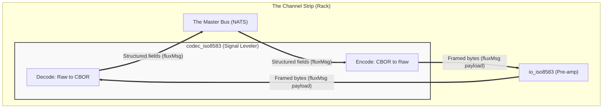

# ISO8583 codec gear

The high-fidelity signal leveler for financial protocol normalization.

<!-- Copyright (c) 2026 JAAB Tech SAS, Uruguay All Rights Reserved -->
<!-- See https://jaab.tech -->

The `codec_iso8583` gear functions as the **Signal Leveler** (Normalization Engine) of the payment mixer. It is a **Native Gear** (Go) responsible for transforming raw, "noisy" protocol dialects (ISO8583 binary/BCD) into a clean, structured **[fluxMsg](../data_model.md#fluxmsg-structure-payload)** (CBOR) format.

By leveraging the **[Moov ISO8583](https://github.com/moov-io/iso8583)** engine, this gear ensures that technical variances between card schemes are leveled into a uniform semantic layer for the internal **[Master Bus Architecture](../../architecture/overview.md#transaction-flow-strategy-two-speed)**.

| Attribute | Details |
| :--- | :--- |
| **Analogy** | **Signal Leveler** (Normalization) |
| **Source Code** | [pkg/gears/native/iso8583/codec](https://github.com/jaab-tech/fluxrig/tree/main/pkg/gears/native/iso8583/codec) |
| **Pairs With** | **[Signal Pre-amp](io_iso8583.md)** (Capture) |
| **Always Emitted Metadata**| `codec.protocol`, `codec.spec_hash`, `iso8583.mti`, `[alias]` |
| **Conditionally Emitted Metadata** | `iso8583.mti_resp` |
| **Mandatory Consumed Metadata** | `[alias]` or `iso8583.field.N` |
| **Signals Sent** | `conn.close` (Kill Switch) |

---

## Reference

The identity, ports, and configuration below are generated from the gear's manifest, so they stay in lockstep with the code.

<!-- AUTOGEN:manifest:codec_iso8583 START (generated by `fluxrig gears doc codec_iso8583`; do not edit by hand) -->
| | |
|---|---|
| **Type** | `codec_iso8583` |
| **Category** | codec |
| **Status** | stable |
| **Terminus** | transparent |

ISO 8583 encode/decode against an SDL spec: raw wire bytes &lt;-&gt; structured fluxMsg fields.

**Ports**

| Port | Direction | Role | Summary |
|---|---|---|---|
| `in` | input | message | Message to encode or decode. |
| `out` | output | message | Encoded or decoded message. |

**Configuration**

| Field | Type | Required | Default | Description |
|---|---|---|---|---|
| `direction` | enum: `auto`, `encode`, `decode` |  | `auto` | encode, decode, or auto (infer from the message). |
| `on_error` | enum: `reject`, `drop`, `kill` |  | `reject` | on a decode/encode failure: reject (emit on the error path), drop (discard), or kill (fail the gear). |
| `spec` | string |  | - | Legacy alias of spec_path. |
| `spec_path` | string |  | - | Path or URN of the ISO 8583 SDL spec. |
<!-- AUTOGEN:manifest:codec_iso8583 END -->

## Architectural signal path

The Codec Gear operates at the heart of the "Channel Strip," performing protocol translation between raw financial signals and the internal bus models.

> [!NOTE]
> Every arrow above is a **unidirectional wire**; the request/response duality of the external socket never reaches the codec. The diagram shows both translation directions in one box for compactness. In a real scenario each codec instance is deployed with a single `direction` (`decode` or `encode`), so a request/response path typically uses **two codec instances**: one decoding what the I/O gear received, one encoding what will be written back. See the [I/O gear signal path](io_iso8583.md#architectural-signal-path) for how one bidirectional socket maps onto two unidirectional ports.

---

## Technical description

Unlike the **[IO TCP Gear](io_tcp.md)**, which handles transport framing, the **Signal Leveler** focuses purely on **Semantic Protocol** logic: field parsing, data type validation, and scheme-specific Dialect adhesion.

### Core engine: Moov ISO8583
The Gear utilizes a **[YAML SDL](../specs/iso8583_sdl.md)** to define dialect rules, powered by **Moov ISO8583**:

*   **Industry Standard Parsing**: Support for BCD, EBCDIC, ASCII, and raw Binary payloads.
*   **Deep Bitmaps**: Automatic handling of Primary and Secondary bitmaps (Support for up to 128 fields). **Tertiary Bitmaps** (Field 129-192) are currently a roadmap item (future).
*   **EMV & Composites**: High-fidelity normalization for **BER-TLV** (Field 55) and complex subfields (Field 48, 62, 127).

---

## Configuration reference

The full field list, with types and defaults, is in the **Manifest reference** table at the top of this page. This gear follows the **[Stack is the Spec](../tech_stack.md)** principle: we do not reinvent the protocol parser; we embed the standard **Moov** library.

## Specification resolution (CAS)

The `spec_path` field supports two resolution strategies to allow for both local development and institutional-grade deployments:

1.  **Local Path**: If the value begins with `/` or `./`, the Gear reads the spec directly from the Rack's filesystem.
2.  **Registry URN**: If the value follows the `name:tag` pattern (e.g., `payment-v1:stable`), the Mixer's **Registry** is consulted. The Mixer retrieves the corresponding YAML blob from the **Content-Addressable Storage (CAS)** and pushes it to the Rack.

> [!NOTE]
> All specifications are tracked via **SHA256 hashes** (First 12 chars). When a spec is loaded, the Codec gear exports the `codec.spec_hash` metadata, ensuring absolute traceability between a transaction and the exact version of the logic used to parse it.

---

## Operational guardrails

**Stateless Mastery**
The `codec_iso8583` is a stateless processor. Metadata mappings (aliases) enable the **[Asymmetric Bus (Coat Check)](coatcheck.md)** pattern, allowing the system to scale without sticky sessions.

**Network Management (MTI 0800)**
While the gear parses 0800 messages, it is the role of the downstream **[Logic Gears](wasm_logic.md)** (within a Scenario) to generate the appropriate responses.

---

## Resilience & error handling

*   **Parsing Failures**: If raw bytes cannot be unpacked (invalid bitmap/length), a `codecerror` is raised.
*   **Validation Failures**: If fields defined in YAML are missing or invalid, a `validationerror` is raised.
*   **Field Constraints**: Support is currently optimized for ISO8583:1987/1993 dialects using Primary and Secondary bitmaps.
*   **The Kill Switch**: If `on_error: "kill"` is set, the Gear signals the **[Pre-amp](io_iso8583.md)** via the Control Plane (`flux.ctrl.{io_gear_id}`) to terminate the connection.

### Resource monitoring (OTel)

The `codec_iso8583` gear exports high-fidelity metrics for dashboarding and alerting:

*   `fluxrig.gear.messages_in` (Counter): Total messages processed by the gear.
*   `fluxrig.gear.processing_time_ms` (Histogram): Processing latency distribution in milliseconds.
*   `fluxrig.codec.iso8583.fields_count` (Histogram): Average field density per message.
*   `fluxrig.gear.errors` (Counter): Cumulative count of packing/unpacking failures.

> [!TIP]
> **See the [Signal Leveler Implementation Guide](../specs/iso8583_sdl.md)** for a deep dive into YAML Dialect definitions.
