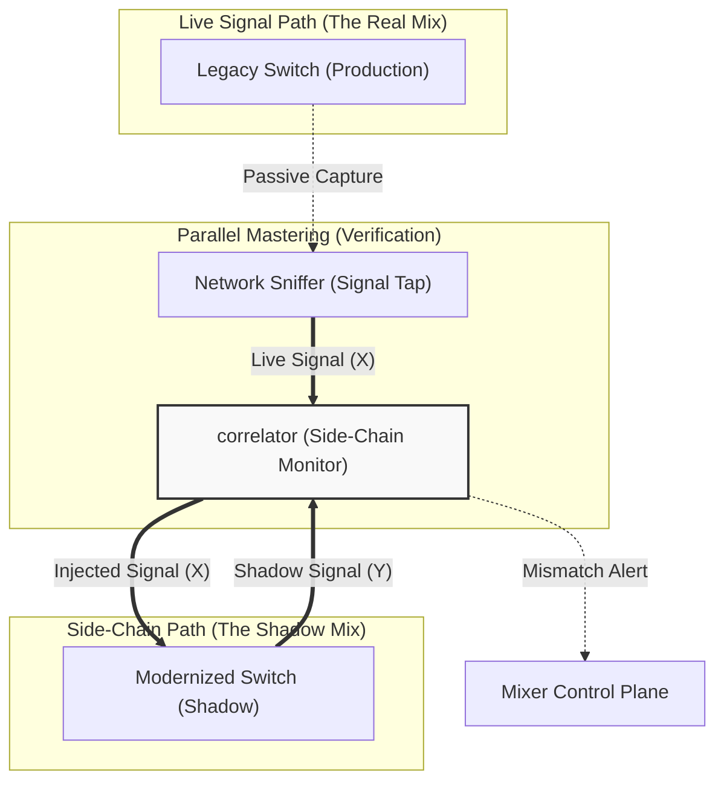

<!-- Copyright (c) 2026 JAAB Tech SAS, Uruguay All Rights Reserved -->
<!-- See https://jaab.tech -->

# Correlator gear

> [!WARNING]
> **Planned Feature (v0.4.3)**: The Correlator Gear is currently in the **Architectural Proposal** phase. This documentation serves as a technical reference for the intended design of "Parallel Mastering" within the **[Testing & Simulation Architecture](../../architecture/testing_simulation.md)**.

The `correlator` gear functions as the **Side-Chain Monitor** of the payment mixer. It performs real-time **Differential Analysis** by comparing response signals from two independent signal pathstypically a **Legacy System** and a modernized **Shadow System**.

By "Monitoring the Mix" in parallel, enterprises can achieve risk-free migrations through continuous **[Parallel Mastering](../../use_cases/payments.md#passive-monitoring-high-fidelity-signal-tap)** of their production logic.

| Attribute | Details |
| :--- | :--- |
| **Type** | `correlator` |
| **Analogy** | **Side-Chain Monitor** (Differential) |
| **Status** | Planned |
| **Source Code** | [pkg/gears/native/correlator](https://github.com/jaab-tech/fluxrig/tree/main/pkg/gears/native/correlator) |
| **Pairs With** | **[Sniffer](network_sniffer.md)**, **[Leveler](codec_iso8583.md)** |
| **Port IN** | `live.in` (from Sniffer), `shadow.in` (from Shadow Sink) |
| **Port IN Cardinality** | Multiple |
| **Port OUT** | `shadow.req.out`, `shadow.res.out`, `out` (Alerts) |
| **Port OUT Cardinality** | Multiple |
| **Always Emitted Metadata**| `diff.status` |
| **Conditionally Emitted** | `diff.mismatches` |
| **Mandatory Consumed** | `[correlation_key]` |
| **Signals Sent** | `fluxrig.event.diff_alert` (On Mismatch) |

---

## The Side-Chain Flow

In **fluxrig**, the Correlator operates "Out-of-Band," receiving non-blocking signal taps from the production wire to ensure **[Mission-Critical Resilience](../../architecture/testing_simulation.md#the-verification-rig-philosophy)**.

---

## Technical Differential Analysis

The Correlator ensures **Signal Parity** by validating both legs of a financial transaction (Ingress Request and Egress Response).

### Shadow Mirroring (4-Leg Flow)
Instead of a "Big Bang" migration, the Correlator orchestrates a **Parallel Run** strategy:

1. **Ingress Request Leg**: Captures the live request, injects it into the **Modernized Switch**, and verifies that the outbound "request signal" matches the legacy production message.
2. **Egress Response Leg**: Captures the legacy response, injects it into the Shadow system, and verifies that the final "response signal" matches the legacy behavior bit-for-bit.

### Differential Features
*   **Semantic Parity**: Compares specific aliases (e.g., `card.account`) defined in the **[Leveler (Codec)](codec_iso8583.md)** rather than raw bytes.
*   **Performance Benchmarking**: Measures the signal latency of the Shadow system relative to the production path.
*   **Delta Reporting**: Emits `fluxrig.event.diff_alert` to the Control Plane on any signal mismatch.

---

## Resilience & Safety

Designed with the **[Air-Gap First](../../architecture/security.md)** philosophy, the Correlator is **Strictly Non-Blocking**. 

*   **Isolation**: It consumes copies of data. Even if the Correlator process crashes, the "Live Mix" (Production Switch) remains unaffected.
*   **Security Gating**: Respects the **[Protocol Orchestration Gateway](../../use_cases/payments.md#the-protocol-orchestration-gateway)** masking rules, performing parity checks on tokenized data within the PCI zone.

> [!TIP]
> Use the Correlator in conjunction with **[Robot Framework](../../reference/robot_framework.md)** to generate human-readable "Parity Reports" for operational stakeholders.
