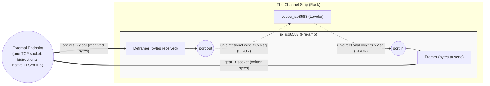

<!-- Copyright (c) 2026 JAAB Tech SAS, Uruguay All Rights Reserved -->
<!-- See https://jaab.tech -->

# ISO8583 I/O gear

The `io_iso8583` gear functions as the **Signal Pre-amp** (Input Stage) for financial protocol orchestration. It is a specialized **Native Gear** (Go) responsible for high-performance TCP capture, framing, and signal integrity.

By leveraging the **[Moov ISO8583](https://github.com/moov-io/iso8583)** protocol library within our high-concurrency bus architecture, the gear provides an ultra-low-latency gateway between external payment endpoints (Acquirers, Issuers, or Hardware) and the **[Active Orchestration & Switching](../../use_cases/payments.md#active-orchestration-and-switching)**.

| Attribute | Details |
| :--- | :--- |
| **Analogy** | **Signal Pre-amp** (Input Stage) |
| **Source Code** | [pkg/gears/native/iso8583/io](https://github.com/jaab-tech/fluxrig/tree/main/pkg/gears/native/iso8583/io) |
| **Pairs With** | **[Signal Leveler](codec_iso8583.md)** (Normalization) |
| **Always Emitted Metadata**| `peer.ip`, `peer.port`, `conn.id`, `fluxrig.source`, `heuristic fields` |
| **Conditionally Emitted** | `iso8583.*_id` (routing), `raw_header` |
| **Mandatory Consumed** | `conn.id` (Session Stickiness Pin) |
| **Signals Sent** | None |
| **Signals Subscribed** | `conn.close` (Kill Switch) via Control Plane (`flux.ctrl.>`) |

---

## Reference

The identity, ports, and configuration below are generated from the gear's manifest, so they stay in lockstep with the code.

<!-- AUTOGEN:manifest:io_iso8583 START (generated by `fluxrig gears doc io_iso8583`; do not edit by hand) -->
| | |
|---|---|
| **Type** | `io_iso8583` |
| **Category** | io |
| **Status** | stable |
| **Terminus** | io |

ISO 8583 TCP I/O: framing, TPDU, native TLS/mTLS. Bridges one bidirectional socket onto two unidirectional ports.

**Ports**

| Port | Direction | Role | Summary |
|---|---|---|---|
| `in` | input | egress | Payload to frame and write to the socket (responses in server mode, requests in client mode). |
| `out` | output | ingress | Deframed payload read from the socket (requests in server mode, responses in client mode). |

**Configuration**

| Field | Type | Required | Default | Description |
|---|---|---|---|---|
| `mode` | enum: `server`, `client` | yes | - | server (listen for terminal/peer connections) or client (dial an upstream). |
| `bind` | string |  | - | server mode: address to listen on, e.g. ':8583'. |
| `connect` | string |  | - | client mode: upstream address to dial, host:port. |
| `connect_timeout` | string |  | `5s` | client mode: max time for the TCP dial. |
| `encoding` | enum: `ascii`, `ebcdic`, `bcd` |  | `ascii` | field encoding used for heuristic inspection: ascii, ebcdic or bcd. |
| `frame_includes_header` | boolean |  | `false` | whether the length prefix counts its own bytes. |
| `frame_length_endian` | enum: `big`, `little` |  | `big` | byte order of the length prefix. |
| `frame_length_size` | enum: `2`, `4` |  | `2` | bytes in the length prefix that frames each message (2 or 4). |
| `heuristic_validation` | boolean |  | `true` | run lightweight MTI/bitmap sanity checks on each frame read. |
| `idle_timeout` | string |  | `15s` | max time a connection may sit idle between frames before it is closed. |
| `max_connections` | integer |  | `4096` | server mode: maximum concurrent connections (0 = unlimited). |
| `preserve_headers` | boolean |  | - | carry the raw protocol header through so the reply can mirror it. |
| `protocol_header_size` | integer |  | - | fixed protocol-header length (bytes) carried before the ISO message; 0 = none. |
| `read_timeout` | string |  | `5s` | max time to read the body of a frame already in progress, e.g. '5s'. |
| `reconnect_wait` | string |  | `5s` | client mode: delay before redialing a dropped connection, e.g. '5s'. |
| `strict_connection_routing` | boolean |  | `true` | return each reply on the exact connection (conn.id) its request arrived on. |
| `tls` | object |  | - | native TLS/mTLS for this socket. |
| `tpdu_enabled` | boolean |  | `false` | whether a 5-byte TPDU precedes the message. |
| `tpdu_length` | integer |  | `5` | TPDU length in bytes when enabled. |
| `tpdu_swap` | boolean |  | `true` | swap the TPDU source/destination addresses on the reply. |
| `unsafe_raw_frame_log` | boolean |  | `false` | log raw frame bytes (hex) at TRACE. Off by default; raw frames carry PAN/SAD, so never enable inside a CDE. |
| `variant` | enum: `generic`, `visa`, `mastercard` |  | `generic` | framing profile: generic, visa (VAP header) or mastercard. |
| `visa_dst_id` | string |  | - | visa variant: destination station id in the VAP header. |
| `visa_src_id` | string |  | - | visa variant: source station id in the VAP header. |
| `write_timeout` | string |  | `2s` | max time for a single socket write. |
<!-- AUTOGEN:manifest:io_iso8583 END -->

## Architectural signal path

In the **fluxrig** channel strip, the I/O gear focuses purely on signal integrity and framed capture, decoupling from the heavier normalization logic.

> [!IMPORTANT]
> **Wires are unidirectional; sockets are bidirectional.** Inside fluxrig, every wire carries messages in exactly one direction. A TCP connection carries bytes both ways. The I/O gear is the bridge between these two worlds: it maps **one bidirectional socket** onto **two unidirectional ports**. Everything *received* from the socket is deframed and emitted on `out`; everything arriving on `in` is framed and *written* to the socket. This mapping is identical in server and client mode; only who initiates the connection differs.

What flows through each port depends on the gear's **mode**, because the mode determines which side speaks first, not how the ports work:

| Mode | `out` emits (received from socket) | `in` consumes (written to socket) |
| :--- | :--- | :--- |
| `server` (terminals dial in) | Requests from terminals | Responses going back to terminals |
| `client` (gear dials upstream) | Responses from the upstream host | Requests going to the upstream host |

A request/response round trip therefore always uses **both** wires of the gear: one message out of `out`, and (after processing elsewhere in the scenario) one message into `in`. The `conn.id` metadata pins the response to the same socket the request arrived on.

---

## Operational features

The Signal Pre-amp provides robust handling for mission-critical financial streams:

*   **Length-Prefixed Framing**: Supports standard 2-byte or 4-byte big-endian framing boundaries.
*   **TPDU Gating**: Specialized logic for NII/TPDU headers, including automatic source/destination swapping on responses.
*   **Security Kill Switch**: Subscribes to the **Universal Control Plane** (`flux.ctrl.{io_gear_id}`). If a downstream Leveler (Codec) Gear detects a "Signal Burst" (malformed payload/parser bomb), it emits a `conn.close` signal, forcing this Pre-amp to aggressively terminate the misbehaving client's socket.
*   **Heuristic Validation**: Performs Layer 1.5 sanity checks (MTI peek, active bitmap detection) for real-time **[Telemetry](../../architecture/observability.md)** without requiring full protocol parsing.

---

## Industry variants & presets

fluxrig supports standard "Presets" to align with major global card schemes and protocols.

| Variant | Framing / Header | Encoding | Description |
| :--- | :--- | :--- | :--- |
| **`generic`** | Standard 2-byte | ASCII | Standard switches (e.g., Postilion). |
| **`visa`** | **V.I.P. Header** (22B) | **EBCDIC** | Visa Base I / SMS. |
| **`mastercard`**| **MIP Header** (4B) | ASCII | Mastercard Interface Processor. |
| **`unionpay`** | **CUP Header** (46B) | Binary | China UnionPay routing blocks. |
| **`hypercom`** | **TPDU Header** (5B) | **BCD** | Legacy POS/ATM terminals. |

---

## Configuration reference

The full field list (framing, TPDU, TLS, connection routing, and timeouts) with types and defaults is in the **Manifest reference** table at the top of this page. This gear follows the **[Air-Gap First](../../architecture/overview.md#system-components)** philosophy, ensuring zero-dependency operation.

> [!CAUTION]
> `unsafe_raw_frame_log` dumps raw frame/payload bytes (hex) at TRACE. It exposes PAN and SAD, so it MUST NOT be enabled inside a Cardholder Data Environment (PCI DSS Req. 3.2/3.4). Use it for protocol debugging in non-CDE test environments only.

When `preserve_headers` is set, the raw framing header is captured into the `iso8583.raw_header` metadata field for exact response mirroring. Since v0.4.3 this value is authoritatively hex-encoded and prefixed with `hex:` for CBOR compatibility.

### Operational modes

**Mode: server (Listener)**
The primary **Ingress Stage** for accepting connections from external payment participants (Acquiring endpoints, POS networks, or ATM clusters).

**Mode: client (Initiator)**
The **Egress Connector**, actively dialing out to upstream processing hosts, financial schemes (e.g., Visa Net), or partner banks (Issuing connectivity).

---

## Ecosystem integration: Moov & NATS

**fluxrig** embeds the **Moov ISO8583** logic within its internal high-speed **[Master Bus](../../architecture/overview.md#transaction-flow-strategy-two-speed)**. Our architecture maintains a strict **Separation of Concerns**:

| Stage | Responsibility | Component |
| :--- | :--- | :--- |
| **Input Stage** | Framing, TPDU, Socket Lifecycle | **io_iso8583** |
| **Mastering Engine**| Field Normalization, Spec Validation | **[codec_iso8583](codec_iso8583.md)** |

**Benefits of this separation**:
*   **Opaque Routing**: Route or load-balance signals at the Pre-amp level without the overhead of deep parsing.
*   **Independent Scaling**: The Pre-amp and Leveler stages can be scaled horizontally on different Racks if required.
*   **Resilience**: The Pre-amp remains "Active" even if a specific logic branch is processing a heavy transaction.

> [!TIP]
> **See the [Signal Leveler Example](codec_iso8583.md#architectural-signal-path)** for the translation stage of this signal path. Remember that only the external socket is bidirectional; every internal hop is a unidirectional wire.
