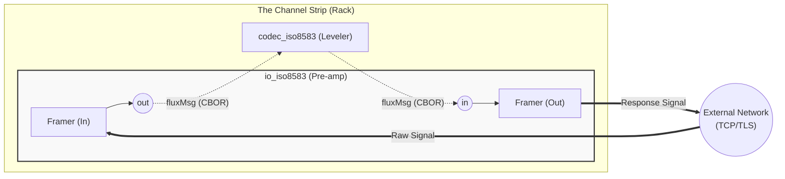

<!-- Copyright (c) 2026 JAAB Tech SAS, Uruguay All Rights Reserved -->
<!-- See https://jaab.tech -->

# ISO8583 I/O gear

The `io_iso8583` gear functions as the **Signal Pre-amp** (Input Stage) for financial protocol orchestration. It is a specialized **Native Gear** (Go) responsible for high-performance TCP capture, framing, and signal integrity.

By leveraging the **[Moov ISO8583](https://github.com/moov-io/iso8583)** protocol library within our high-concurrency bus architecture, the gear provides an ultra-low-latency gateway between external payment endpoints (Acquirers, Issuers, or Hardware) and the **[Active Orchestration & Switching](../../use_cases/payments.md#active-orchestration-and-switching)**.

| Attribute | Details |
| :--- | :--- |
| **Type** | `io_iso8583` |
| **Analogy** | **Signal Pre-amp** (Input Stage) |
| **Status** | Stable |
| **Source Code** | [pkg/gears/native/iso8583/io](https://github.com/jaab-tech/fluxrig/tree/main/pkg/gears/native/iso8583/io) |
| **Pairs With** | **[Signal Leveler](codec_iso8583.md)** (Normalization) |
| **Port IN** | `in`: consumes egress payload for network transmission |
| **Port IN Cardinality** | Single |
| **Port OUT** | `out`: emits ingress signal as **[fluxMsg](../data_model.md#fluxmsg-structure-payload)** (CBOR) |
| **Port OUT Cardinality** | Single |
| **Always Emitted Metadata**| `peer.ip`, `peer.port`, `conn.id`, `fluxrig.source`, `heuristic fields` |
| **Conditionally Emitted** | `iso8583.*_id` (routing), `raw_header` |
| **Mandatory Consumed** | `conn.id` (Session Stickiness Pin) |
| **Signals Sent** | None |
| **Signals Subscribed** | `conn.close` (Kill Switch) via Control Plane (`flux.ctrl.>`) |

---

## Architectural signal path

In the **fluxrig** channel strip, the I/O gear focuses purely on signal integrity and framed capture, decoupling from the heavier normalization logic.

---

## Operational features

The Signal Pre-amp provides robust handling for mission-critical financial streams:

*   **Length-Prefixed Framing**: Supports standard 2-byte or 4-byte big-endian framing boundaries.
*   **TPDU Gating**: Specialized logic for NII/TPDU headers, including automatic source/destination swapping on responses.
*   **Security Kill Switch**: Subscribes to the **Universal Control Plane** (`flux.ctrl.{io_gear_id}`). If a downstream Leveler (Codec) Gear detects a "Signal Burst" (malformed payload/parser bomb), it emits a `conn.close` signal, forcing this Pre-amp to aggressively terminate the misbehaving client's socket.
*   **Heuristic Validation**: Performs Layer 1.5 sanity checks (MTI peek, active bitmap detection) for real-time **[Telemetry](../../architecture/observability.md)** without requiring full protocol parsing.

---

## Industry variants & presets

fluxrig supports standard "Presets" to align with major global card schemes and protocols.

| Variant | Framing / Header | Encoding | Description |
| :--- | :--- | :--- | :--- |
| **`generic`** | Standard 2-byte | ASCII | Standard switches (e.g., Postilion). |
| **`visa`** | **V.I.P. Header** (22B) | **EBCDIC** | Visa Base I / SMS. |
| **`mastercard`**| **MIP Header** (4B) | ASCII | Mastercard Interface Processor. |
| **`unionpay`** | **CUP Header** (46B) | Binary | China UnionPay routing blocks. |
| **`hypercom`** | **TPDU Header** (5B) | **BCD** | Legacy POS/ATM terminals. |

---

## Configuration reference

The strategy follows the **[Air-Gap First](../../architecture/overview.md#system-components)** philosophy, ensuring zero-dependency operation.

### Framing (the "container")
Parameters controlling how the raw stream is segmented into message units.

| Field | Type | Description | Default |
| :--- | :--- | :--- | :--- |
| `frame_length_size` | `int` | Length prefix size (2 or 4 bytes). | `2` |
| `frame_length_endian`| `string`| Big-endian (`"big"`) or Little-endian (`"little"`). | `"big"` |
| `frame_includes_header`| `bool` | If true, length prefix includes the header bytes. | `false` |
| `tpdu_swap` | `bool` | Swap Source/Destination TPDUs in response. | `true` |
| `variant` | `string` | Applies an industry preset (e.g., `"visa"`). | `"generic"` |
| `heuristic_validation`| `bool` | Enable Layer 1.5 bitmap/MTI sanity checks. | `true` |

### Connection & routing (the "signal path")
Controls affinity and metadata preservation for bidirectional streams.

| Field | Type | Description | Default |
| :--- | :--- | :--- | :--- |
| `strict_connection_routing`| `bool` | If true, strictly matches `conn.id` for egress. If false, falls back to any active connection (useful for Loopback/Echo). | `true` |
| `preserve_headers` | `bool` | If true, captures raw protocol headers (e.g. VIP) into `iso8583.raw_header` metadata for exact response mirroring. | `true` |
| `max_connections` | `int` | Max concurrent connections. | `4096` |
| `read_timeout` | `string` | Socket read timeout. | `30s` |
| `write_timeout` | `string` | Socket write timeout. | `5s` |
| `idle_timeout` | `string` | Session idle timeout. | `60s` |
| `iso8583.raw_header` | Hex String | The raw framing header (e.g. 64-bit BCD) extracted from the socket. Since v0.4.3, this is authoritatively hex-encoded and prefixed with `hex:` for CBOR compatibility. | N/A |

### Operational modes

**Mode: server (Listener)**
The primary **Ingress Stage** for accepting connections from external payment participants (Acquiring endpoints, POS networks, or ATM clusters).

**Mode: client (Initiator)**
The **Egress Connector**, actively dialing out to upstream processing hosts, financial schemes (e.g., Visa Net), or partner banks (Issuing connectivity).

---

## Ecosystem integration: Moov & NATS

**fluxrig** embeds the **Moov ISO8583** logic within its internal high-speed **[Master Bus](../../architecture/overview.md#transaction-flow-strategy-two-speed)**. Our architecture maintains a strict **Separation of Concerns**:

| Stage | Responsibility | Component |
| :--- | :--- | :--- |
| **Input Stage** | Framing, TPDU, Socket Lifecycle | **io_iso8583** |
| **Mastering Engine**| Field Normalization, Spec Validation | **[codec_iso8583](codec_iso8583.md)** |

**Benefits of this separation**:
*   **Opaque Routing**: Route or load-balance signals at the Pre-amp level without the overhead of deep parsing.
*   **Independent Scaling**: The Pre-amp and Leveler stages can be scaled horizontally on different Racks if required.
*   **Resilience**: The Pre-amp remains "Active" even if a specific logic branch is processing a heavy transaction.

> [!TIP]
> **See the [Signal Leveler Example](codec_iso8583.md#architectural-signal-path)** for a detailed architectural diagram of this bidirectional signal flow.
