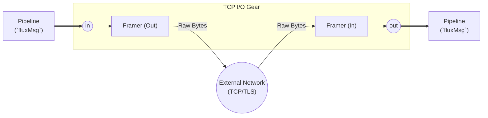

# TCP I/O gear

 The `io_tcp` gear is the primary **Native Gear** for handling raw TCP connections. It is designed for proprietary, length-prefixed, or stream-based protocols (like ISO8583, healthcare HL7, or raw IoT telemetry) where HTTP is unsuitable.

 It handles the "Dirty Work" of networking:

 *   **Connection lifecycle** (Listen/Dial, Reconnect, Timeouts).
 *   **Framing** (Splitting specific byte streams into discrete messages).
 *   **Idle Timeouts** (Automatic session cleanup - *Planned*).
 *   **TLS termination** (Server-side & mTLS 1.3 - **[Roadmap]**).
 *   **Buffers** (Read/Write buffering to prevent stalling).

 It does **NOT** parse the payload. It delivers `RawPayload` (bytes) to the Rack, where a **Codec Gear** (e.g., ISO8583) turns it into structured data.

| Attribute | Details |
| :--- | :--- |
| **Type** | `io_tcp` |
| **Category** | I/O gears |
| **Status** | Stable |
| **Source Code** | [pkg/gears/native/io_tcp](https://github.com/jaab-tech/fluxrig/tree/main/pkg/gears/native/io_tcp) |
| **Pairs With** | Codec Gears (e.g., `codec_iso8583`) |
| **Port IN** | Egress Payload (from pipeline to network) |
| **Port IN Cardinality** | Single |
| **Port OUT** | Ingress Payload (from network to pipeline) |
| **Port OUT Cardinality** | Single |
| **Always Emitted Metadata** | `conn.id`, `peer.ip`, `peer.port` |
| **Conditionally Emitted Metadata** | None |
| **Mandatory Consumed Metadata** | `conn.id` (Egress Mode) |
| **Optional Consumed Metadata** | None |
| **Signals Sent** | None |
| **Signals Subscribed** | `conn.close` (Kill Switch) - **[Supported]** |

## Architecture



## Configuration

### Common options

| Field | Type | Required | Description | Default |
| :--- | :--- | :--- | :--- | :--- |
| `mode` | `string` | **Yes** | Operation mode: `"server"` or `"client"`. | - |
| `delimiter` | `string` | No | Message delimiter (e.g., `\n`, `0x03`). If empty, uses ScanLines. | `\n` |
| `delimiter_position` | `string` | No | `"suffix"` (default) or `"prefix"`. | `suffix` |
| `delimiter_include` | `bool` | No | Keep delimiter in ingress payload. | `false` |
| `delimiter_append` | `bool` | No | Egress: Append delimiter to outgoing payload. | `false` |
| `max_connections` | `int` | No | Limit concurrent connections (0 = unlimited). | `4096` |

### Mode: server (listener)

Acts as a Gateway, accepting connections from POS terminals, ATMs, or partners.

| Field | Type | Required | Description |
| :--- | :--- | :--- | :--- |
| `bind` | `string` | **Yes** | Address to bind to (e.g., `:3034`, `0.0.0.0:8090`). |
| `idle_timeout` | `string` | No | Close connection if idle for this duration (e.g., `60s`). | `60s` |

### Mode: client (initiator)

Acts as a Connector, reaching out to a host (e.g., Visa, Core Banking).

| Field | Type | Required | Description |
| :--- | :--- | :--- | :--- |
| `connect` | `string` | **Yes** | Remote address (e.g., `10.0.1.5:4000`). |
| `reconnect_wait` | `string` | No | Wait time between connection attempts. | `5s` |
| `idle_timeout` | `string` | No | Close connection if idle for this duration. | `60s` |

## Framing strategies

Currently, `io_tcp` supports **Delimiter-based framing**.

| Strategy | Config Key | Description |
| :--- | :--- | :--- |
| **Delimiter** | `delimiter` | Reads until specific byte (e.g. `\n`, `0x03`). **Warning**: Does not support escaping. If the payload canonically contains the delimiter, framing will break. Use fixed-length framing for binary protocols. |
| **ScanLines** | (Default) | If `delimiter` is empty, breaks on `\n` (Buffer default). |

> **Note**: Fixed-length framing (e.g. 2-byte BE) is planned for future releases.

```yaml

- name: "tcp-server"
  type: "io_tcp"
  config:
    mode: "server"
    bind: ":3034"
    delimiter: "\n"
    delimiter_include: false
```

## Description

1.  **Ingress (`receive`)**:
    *   Gear reads bytes from socket.
    *   **Framer** detects message boundary (e.g., reads header `00 20` -> 32 bytes).
    *   Gear encapsulates the 32 bytes into a `fluxMsg`.
    *   **Metadata** is added: `conn.id`, `peer.ip`, `peer.port`.
    *   Message is published to the configured **NATS Subject**.

2.  **Egress (`send`)**:
    *   Gear subscribes to **NATS Subject**.
    *   Receives `fluxMsg`. extracts `conn.id` from Metadata.
    *   Finds the active socket in the **Connection Registry**.
    *   Writes `fluxMsg.RawPayload` to the socket (prefixing Length Header if configured).

## Control plane integration (the "kill switch")

To ensure robust error handling, this gear subscribes to the **Universal Control Plane** to facilitate the "Kill Switch" pattern.

*   **Subject**: `flux.ctrl.{gear_id}`
*   **Command**: `conn.close`
*   **Purpose**: Allows logic/codec gears to force a socket disconnection when they detect a fatal protocol violation (e.g. invalid MTI), even though they don't own the socket.

```json
{
  "command": "conn.close",
  "payload": {
    "conn_id": "uuid-1234",
    "reason": "protocol_violation",
    "code": "isomsg_pack_fail"
  }
}
```

## Rationale & extended info

### Observability

The `io_tcp` gear exports native OpenTelemetry metrics regarding the health of its connection pools.

*   `fluxrig_io_tcp_connections_active` (Gauge): Tracks currently established sockets per gear.
*   `fluxrig_io_tcp_bytes_read_total` (Counter): Total bytes ingested from the wire.
*   `fluxrig_io_tcp_bytes_written_total` (Counter): Total bytes pushed to the wire.
*   `fluxrig_io_tcp_frame_errors_total` (Counter): Logs the number of malformed frames or buffer overflows detected.

### Resource limits

Unlike higher-level gears, TCP I/O directly bounds to OS resources (File Descriptors).
Currently, the gear relies on both OS-level `ulimit -n` and an internal `max_connections` setting. It is strongly recommended to set a high OS limit (e.g., `65535`) while using the `max_connections` field for application-level graceful rejection.

### Backpressure handling
The gear maps the TCP window directly to NATS JetStream backpressure.

*   **Ingress**: If the downstream pipeline (NATS) is overwhelmed, publishing blocks. This causes the internal Go buffers to fill, which naturally applies backpressure to the TCP read operation, causing the client's TCP window to close.
*   **Egress**: If the remote client reads too slowly, the outbound socket buffer fills, applying backpressure to the NATS consumer, preventing memory bloat inside the Rack process.
