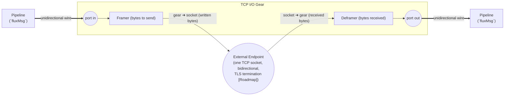

# TCP I/O gear

 The `io_tcp` gear is the primary **Native Gear** for handling raw TCP connections. It is designed for proprietary, length-prefixed, or stream-based protocols (like ISO8583, healthcare HL7, or raw IoT telemetry) where HTTP is unsuitable.

 It handles the "Dirty Work" of networking:

 *   **Connection lifecycle** (Listen/Dial, Reconnect, Timeouts).
 *   **Framing** (Splitting specific byte streams into discrete messages).
 *   **Idle Timeouts** (Automatic session cleanup; `idle_timeout`, default `60s`).
 *   **TLS termination** (Server-side & mTLS 1.3 - **[Roadmap]**).
 *   **Buffers** (Read/Write buffering to prevent stalling).

 It does **NOT** parse the payload. It delivers `RawPayload` (bytes) to the Rack, where a **Codec Gear** (e.g., ISO8583) turns it into structured data.

| Attribute | Details |
| :--- | :--- |
| **Source Code** | [pkg/gears/native/io_tcp](https://github.com/jaab-tech/fluxrig/tree/main/pkg/gears/native/io_tcp) |
| **Pairs With** | Codec Gears (e.g., `codec_iso8583`) |
| **Always Emitted Metadata** | `conn.id`, `peer.ip`, `peer.port` |
| **Conditionally Emitted Metadata** | None |
| **Mandatory Consumed Metadata** | `conn.id` (Egress Mode) |
| **Optional Consumed Metadata** | None |
| **Signals Sent** | None |
| **Signals Subscribed** | `conn.close` (Kill Switch) - **[Supported]** |

## Reference

The identity, ports, and configuration below are generated from the gear's manifest, so they stay in lockstep with the code.

<!-- AUTOGEN:manifest:io_tcp START (generated by `fluxrig gears doc io_tcp`; do not edit by hand) -->
| | |
|---|---|
| **Type** | `io_tcp` |
| **Category** | io |
| **Status** | stable |
| **Terminus** | io |

Generic TCP I/O with delimiter/length framing. Bridges one bidirectional socket onto two unidirectional ports.

**Ports**

| Port | Direction | Role | Summary |
|---|---|---|---|
| `in` | input | egress | Payload to frame and write to the socket. |
| `out` | output | ingress | Deframed payload read from the socket. |

**Configuration**

| Field | Type | Required | Default | Description |
|---|---|---|---|---|
| `mode` | enum: `server`, `client` | yes | - | server (listen for connections) or client (dial an upstream). |
| `bind` | string |  | `:8080` | server mode: address to listen on, e.g. ':9000'. |
| `connect` | string |  | - | client mode: upstream address to dial, host:port. |
| `delimiter` | string |  | - | message delimiter for framing (e.g. a newline, 0x03); if empty, frames on newline (ScanLines). |
| `delimiter_append` | boolean |  | `false` | egress: append the delimiter to outgoing payloads. |
| `delimiter_include` | boolean |  | `false` | ingress: keep the delimiter in the emitted payload. |
| `delimiter_position` | enum: `suffix`, `prefix` |  | `suffix` | where the delimiter sits relative to the message: suffix or prefix. |
| `idle_timeout` | string |  | `60s` | max time a connection may sit idle before it is closed. |
| `max_connections` | integer |  | `4096` | server mode: maximum concurrent connections (0 = unlimited). |
| `reconnect_wait` | string |  | `5s` | client mode: delay before redialing a dropped connection, e.g. '1s'. |
<!-- AUTOGEN:manifest:io_tcp END -->

## Architecture

> [!IMPORTANT]
> **Wires are unidirectional; sockets are bidirectional.** The gear maps one bidirectional TCP socket onto two unidirectional ports: bytes *received* from the socket are deframed and emitted on `out`; messages arriving on `in` are framed and *written* to the socket. See the [architecture overview](../../architecture/overview.md) for the Wire definition and the [ISO8583 I/O gear](io_iso8583.md#architectural-signal-path) for the mode-by-mode port table.



## Configuration

The full field list, with types and defaults, is in the **Manifest reference** table at the top of this page. In brief:

- Mode `server` (listener) acts as a gateway, accepting connections from POS terminals, ATMs, or partners; it requires `bind`.
- Mode `client` (initiator) acts as a connector, reaching out to a host (e.g. Visa, core banking); it requires `connect`.

## Framing strategies

Currently, `io_tcp` supports **Delimiter-based framing**.

| Strategy | Config Key | Description |
| :--- | :--- | :--- |
| **Delimiter** | `delimiter` | Reads until specific byte (e.g. `\n`, `0x03`). **Warning**: Does not support escaping. If the payload canonically contains the delimiter, framing will break. Use fixed-length framing for binary protocols. |
| **ScanLines** | (Default) | If `delimiter` is empty, breaks on `\n` (Buffer default). |

> **Note**: Fixed-length framing (e.g. 2-byte BE) is planned for future releases.

```yaml

- name: "tcp-server"
  type: "io_tcp"
  config:
    mode: "server"
    bind: ":3034"
    delimiter: "\n"
    delimiter_include: false
```

## Description

1.  **Ingress (`receive`)**:
    *   Gear reads bytes from socket.
    *   **Framer** detects message boundary (e.g., reads header `00 20` -> 32 bytes).
    *   Gear encapsulates the 32 bytes into a `fluxMsg`.
    *   **Metadata** is added: `conn.id`, `peer.ip`, `peer.port`.
    *   Message is published to the configured **NATS Subject**.

2.  **Egress (`send`)**:
    *   Gear subscribes to **NATS Subject**.
    *   Receives `fluxMsg`. extracts `conn.id` from Metadata.
    *   Finds the active socket in the **Connection Registry**.
    *   Writes `fluxMsg.RawPayload` to the socket (prefixing Length Header if configured).

## Control plane integration (the "kill switch")

To ensure robust error handling, this gear subscribes to the **Universal Control Plane** to facilitate the "Kill Switch" pattern.

*   **Subject**: `flux.ctrl.{gear_id}`
*   **Command**: `conn.close`
*   **Purpose**: Allows logic/codec gears to force a socket disconnection when they detect a fatal protocol violation (e.g. invalid MTI), even though they don't own the socket.

```json
{
  "command": "conn.close",
  "payload": {
    "conn_id": "uuid-1234",
    "reason": "protocol_violation",
    "code": "isomsg_pack_fail"
  }
}
```

## Rationale & extended info

### Observability

The `io_tcp` gear exports native OpenTelemetry metrics regarding the health of its connection pools.

*   `fluxrig.port.connections_active` (Gauge): Tracks currently established sockets per gear.
*   `fluxrig.port.bytes_in` (Counter): Total bytes ingested from the wire.
*   `fluxrig.port.bytes_out` (Counter): Total bytes pushed to the wire.
*   `fluxrig.gear.messages_in` (Counter): Total messages ingested from the wire.
*   `fluxrig.gear.messages_out` (Counter): Total messages pushed to the wire.
*   `fluxrig.gear.errors` (Counter): Logs the number of malformed frames or buffer overflows detected.

### Resource limits

Unlike higher-level gears, TCP I/O directly bounds to OS resources (File Descriptors).
Currently, the gear relies on both OS-level `ulimit -n` and an internal `max_connections` setting. It is strongly recommended to set a high OS limit (e.g., `65535`) while using the `max_connections` field for application-level graceful rejection.

### Backpressure handling
The gear maps the TCP window directly to NATS JetStream backpressure.

*   **Ingress**: If the downstream pipeline (NATS) is overwhelmed, publishing blocks. This causes the internal Go buffers to fill, which naturally applies backpressure to the TCP read operation, causing the client's TCP window to close.
*   **Egress**: If the remote client reads too slowly, the outbound socket buffer fills, applying backpressure to the NATS consumer, preventing memory bloat inside the Rack process.
