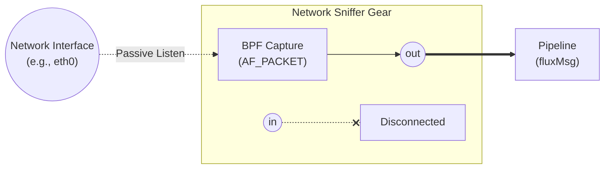

<!-- Copyright (c) 2026 JAAB Tech SAS, Uruguay All Rights Reserved -->
<!-- See https://jaab.tech -->

# Network sniffer [Roadmap]

> [!WARNING]
> **[Roadmap]**: This gear is currently in the **Architectural Proposal** phase and not yet available in the core release.

The `network_sniffer` gear is an I/O gear designed for **Non-Intrusive Packet Capture** (pcap/AF_PACKET). Rather than terminating TCP connections or acting as a proxy, this gear passively listens to raw network interfaces to capture traffic.

While broadly applicable, its primary strategic use case within the **fluxrig** ecosystem is **Passive ISO8583 Capture** for environments where altering routing or introducing a proxy is not permitted.

It extracts the raw payloads from the targeted packets and passes them into the rig as standard `RawPayload` (bytes), where they can be parsed by the `codec_iso8583` gear for observability, analytics, or shadow mirroring without touching the active payment path.

## Type definition

```yaml
type: "io_network_sniffer"
```

| Attribute | Details |
| :--- | :--- |
| **Type** | `io_network_sniffer` |
| **Category** | I/O gears |
| **Status** | Planned |
| **Source Code** | [pkg/gears/native/network_sniffer](https://github.com/jaab-tech/fluxrig/tree/main/pkg/gears/native/network_sniffer) |
| **Pairs With** | Codec Gears (e.g., `codec_iso8583`), `correlator` |
| **Port IN** | N/A (Disconnected) |
| **Port IN Cardinality** | Absent |
| **Port OUT** | Ingress Payload (Captured bytes) |
| **Port OUT Cardinality** | Single |
| **Always Emitted Metadata** | `src.ip`, `dst.ip`, `src.port`, `dst.port` |
| **Conditionally Emitted Metadata** | None |
| **Mandatory Consumed Metadata** | None |
| **Optional Consumed Metadata** | None |
| **Signals Sent** | None |
| **Signals Subscribed** | None |

## Architecture



## Configuration (proposed)

| Field | Type | Required | Description | Default |
| :--- | :--- | :--- | :--- | :--- |
| `interface` | `string` | **Yes** | Network interface to bind to (e.g., `eth0`, `any`). | - |
| `bpf_filter` | `string` | No | Berkeley Packet Filter expression to select traffic (e.g., `tcp port 11000 and src host 10.0.0.5`). | `""` |
| `promiscuous` | `bool` | No | Whether to enable promiscuous mode on the interface. | `false` |
| `snaplen` | `int` | No | Maximum bytes to capture per packet. | `65535` |

### Example: capturing established POS traffic

```yaml

- name: "passive-capture"
  type: "io_network_sniffer"
  config:
    interface: "eth0"
    bpf_filter: "tcp dst port 4000"
    promiscuous: true
```

## Description

1.  **Ingress (`receive`)**:
    *   The gear binds to the specified network interface using a high-performance capture mechanism (e.g., AF_PACKET on Linux or pcap).
    *   It applies the `bpf_filter` directly at the kernel level for maximum efficiency.
    *   It reassembles TCP streams from the captured packets to reconstruct the original application payload (handling out-of-order packets and retransmissions).
    *   Once a complete framing boundary is identified (configurable), it encapsulates the bytes into a `fluxMsg`.
    *   **Metadata** is added: `src.ip`, `dst.ip`, `src.port`, `dst.port`.
    *   The message is published to the internal NATS bus.

2.  **Egress (`send`)**:
    *   The `io_network_sniffer` gear is strictly **read-only**. It does not support packet injection back into the network. Egress ports are physically disconnected at the gear level.

## Rationale & extended info

The Network Sniffer is a vital tool for the "Stateless Edge" and risk-free modernization strategies:

*   **Zero-downtime tap**: Tap an existing switch or core banking connection via a span port.
*   **Shadow production**: Feed live, parsed production data (via the codec Gear) into a new environment for 100% realistic load testing without intercepting live transactions.
*   **Compliance archival**: Capture all ISO8583 traffic continuously, strip PII via a logic Gear, and stream to an immutable enterprise data lake (e.g., ClickHouse) for PCI-DSS compliant auditing.

