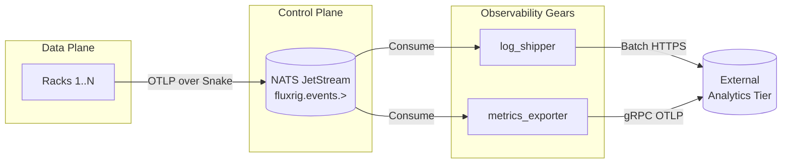

# Observability gears

> [!WARNING]
> **[Roadmap]**: This gear is currently under development and not yet available.

> [!WARNING]
> **Status: [Roadmap]**. The dedicated `log_shipper` and `metrics_exporter` Native Gears are slated for upcoming releases. 
Currently, observability is handled monolithically within the Mixer's core architecture. This document outlines the planned disaggregation of telemetry pipelines into individual gears.

As **fluxrig** scales to handle enterprise data volumes, the responsibility of shipping telemetry (traces, metrics, and logs) to external providers (like Elasticsearch, Datadog, or ClickHouse) will be delegated to specific **Native Observability Gears**.

## Motivation

Currently, the Mixer natively implements the Embedded (DuckDB) and Enterprise (ClickHouse/OpenSearch) observability tiers. However, by transforming these export pipelines into autonomous Native Gears, we gain:

*   **Decoupling**: Disconnecting the Mixer's critical Control Plane responsibilities from Data Plane telemetry egress.
*   **Resilience**: Using NATS JetStream as a durable buffer, an Observability Gear can handle external database outages without blocking cluster operations.
*   **Extensibility**: Writing a new exporter for a proprietary system (e.g., Splunk) simply requires adding a new gear, rather than modifying the core Mixer binary.

## Architecture

## Planned gears

### `log_shipper`

Responsible for consuming structured application logs from `fluxrig.events.logs` and shipping them to full-text search destinations.

**Features:**

*   **Batching & Compression**: Aggregating raw log lines into compressed NDJSON batches.
*   **Backoff Policies**: Retrying HTTP POST requests cleanly if OpenSearch/Elasticsearch becomes unresponsive.
*   **Filtering**: Using bloblang (via Bento internals) to scrub PII from logs before egress.

**Target Destinations:** OpenSearch, Elasticsearch, Datadog Logs.

### `metrics_exporter`

Responsible for aggregating Counter and Gauge telemetry from the Racks and formatting it for time-series databases.

**Features:**

*   **Prometheus Pushgateway**: Pushing metrics for ephemeral jobs.
*   **OTLP gRPC**: Directly streaming OpenTelemetry metrics to collectors.
*   **Down-sampling**: Aggregating 1-second metrics into 1-minute buckets before egress to save storage cost.

**Target Destinations:** Prometheus, SigNoz, Grafana Mimir, Datadog Metrics.

## Implementation timeline

These gears will be built natively in Go and integrated into the primary Binary, configurable through the `fluxrig-mixer.toml` and standard YAML topologies. Please track the internal roadmap for their release alongside the "Enterprise Tier" observability overhaul.
