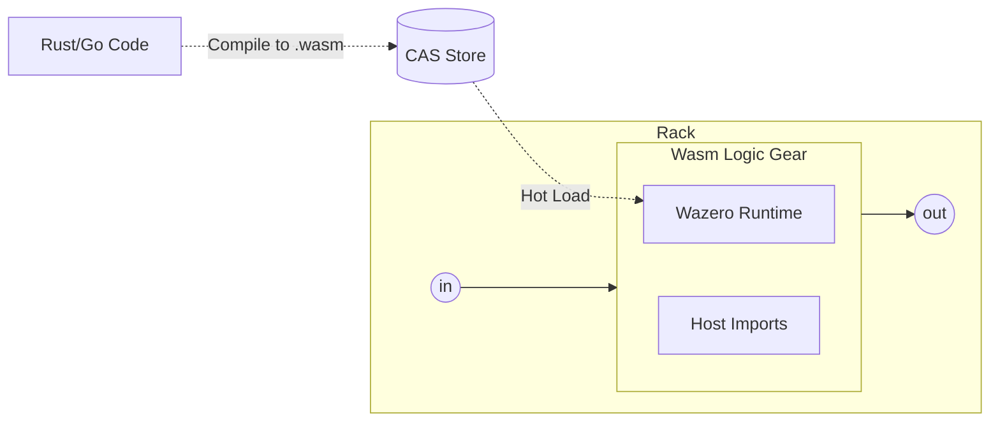

# Wasm logic gear

The **Wasm Logic Gear** is the primary extensibility point for the **fluxrig** data plane. It allows developers to inject high-performance, sandboxed business logic into the signal flow using any language that compiles to **WebAssembly (Wasm)**.

> [!IMPORTANT]
> **Technical Foundation**: This gear leverages the **[Wazero](https://wazero.io/)** runtime, the only zero-dependency, 100% Go WebAssembly implementation, to ensure architectural purity and extreme performance without requiring CGO.

The **Wasm Logic Gear** is a secure, sandboxed execution environment that allows developers to run complex, stateful, or computationally heavy business logic written in any language (Rust, C++, Go, Zig, AssemblyScript) directly within the fluxrig pipeline.

## Why Wasm?

While the core `fluxrig` engine is built for extreme protocol orchestration, specific business rules (e.g., complex tax calculations, custom fraud heuristics, or proprietary signal transformations) often require a programmatic environment. Wasm provides this while maintaining:

1.  **Performance**: Near-native execution speeds via JIT/AOT compilation.
2.  **Security**: A strict, **Default-Deny** sandbox model that isolates logic from the host system.
3.  **Portability**: "Build once, run anywhere" across the distributed Rack fleet.

## Standards Compliance

Our implementation strictly adheres to the following industry standards to ensure long-term ecosystem compatibility:

*   **[W3C WebAssembly Core 2.0](https://www.w3.org/TR/wasm-core-2/)**: Ensures deterministic execution and binary portability.
*   **[WASI (WebAssembly System Interface)](https://wasi.dev/)**: Provides a standardized, capability-based interface for system resources (limited to approved descriptors).
*   **CBOR-Based ABI**: Uses **[RFC 8949 (CBOR)](https://www.rfc-editor.org/rfc/rfc8949.html)** for high-performance signal passing between the Go host and the Wasm guest, achieving sub-millisecond data-plane latency.

## Wasm Supply Chain Security

To prevent malicious payloads from executing at the edge, `fluxrig` enforces a strict cryptographic supply chain:

1. **Vendor Signatures**: Third-party developers compile their `.wasm` binary and sign it using an Ed25519 private key via `fluxrig wasm sign`. This embeds a `fluxrig.signature` directly into the Wasm custom sections.
2. **Catalog Import**: Ops engineers import the signed `.wasm` file into the Mixer using `fluxrig wasm import`. The Mixer cryptographically validates the signature against its trusted `data/wasm/keys` directory.
3. **Mixer Countersignature**: Upon successful validation, the Mixer countersigns the binary with its own Cluster Authority key (`fluxrig.cluster.signature`) and stores it in the registry.
4. **Edge Validation**: When an edge Rack hot-loads the binary via NATS Snake, it validates the Mixer's countersignature before passing the payload to `wazero` for compilation. Any payload failing signature verification is immediately dropped.

## Architecture



## Application Binary Interface (ABI)

The Wasm gear will communicate with the host Rack using a strictly defined ABI based on `CBOR` memory pointers.

1. **Guest Input**: The host Rack writes the serialized `fluxMsg` into the guest's linear memory.
2. **Guest Execution**: The Wasm module processes the data.
3. **Guest Output**: The Wasm module returns a pointer to the modified `fluxMsg` (or an array of messages representing fan-out) and an exit code (e.g., `0=OK`, `1=Reject`, `2=Drop`).

### Host imports (capabilities)

To remain useful while sandboxed, the host Rack will expose secure functions to the guest:

*   `flux_kv_get(key)` / `flux_kv_put(key, val)`: Access to the global NATS KV store.
*   `flux_log_info(msg)`: Emits structured logs into the system telemetry stream.
*   `flux_req_http(url, body)`: *Optional* outbound HTTP fetch capability (requires explicit permission in scenario configuration).

## Integration example

```yaml
gears:

  - name: "fraud_evaluator"
    type: "wasm_logic"
    config:
      # Pulled from the CAS registry via URN
      module: "urn:wasm:fraud-scorer:v2.1"
      # Capabilities granted to the sandbox
      allow_http: false
      allow_kv: true
```
