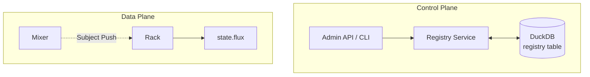
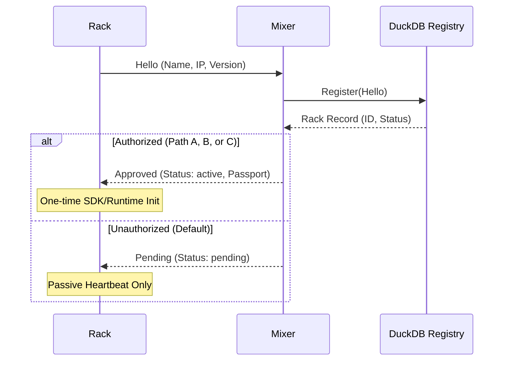

# Identity & registry

The **Identity & State Registry** is the central nervous system for node identity, dynamic configuration distribution, and cluster topology within the **fluxrig** platform. It operates strictly within the Control Plane.

## Philosophy

In distributed computing environments, autonomous entities (Racks) cannot be trusted to self-assign their own identity because they might be cloned, stolen, or spoofed. The Registry solves this by acting as the single source of truth for:

1. **Who** is in the cluster (Identity allocation).
2. **What** each node is allowed to do (State execution logic).
3. **How** nodes prove their identity (Cryptographic Passports).

## Architecture

The Registry runs exclusively on **Mixer** nodes. It leverages an embedded **DuckDB** database for long-term relational indexing, while utilizing the **Snake Tunnel** to distribute scenario updates and orchestration signals to edge Racks.



## The `registry` table

The primary engine of the Registry is the `registry` table inside the Mixer's DuckDB instance.

| Column | Type | Description |
| :--- | :--- | :--- |
| `entity_id` | `UUID` | **Primary Key**. The 128-bit `fluxEntityID` containing the node type and identity hint. |
| `type_id` | `USMALLINT` | Component Type: `2` (Mixer), `3` (Rack), `8` (Snake Tunnel). |
| `machine_id` | `UUID` | The authoritative identity assigned to the device (UUID v7). |
| `name` | `TEXT` | Human-readable Hostname (e.g., `rack-nyc-01`). Must be unique. |
| `status` | `TEXT` | `active`, `pending` (awaiting enrollment), or `offline`. |
| `version` | `TEXT` | Git SHA or SemVer of the running binary. |
| `attributes` | `JSON` | Immutable metadata (e.g., hardware MAC, public Ed25519 key). |
| `stats` | `JSON` | Real-time ephemeral metrics (CPU, Memory, Goroutines). |
| `last_seen` | `TIMESTAMP` | Updated automatically via heartbeat pings. |

## Enrollment & adoption lifecycle

A **fluxrig** deployment follows a robust **Enrollment Architecture**. Racks are admitted to the rig through a formal process that decouples physical connectivity from functional authorization.

### The deferred adoption mechanism

To ensure deterministic resource allocation and 100% metric attribution, **fluxrig** utilizes a **Deferred Adoption** lifecycle. 

> [!IMPORTANT]
> A Rack in `pending` status does NOT initialize its **Gear Runtime** or **OpenTelemetry SDK**. It remains in a passive heartbeat-only state until it is officially adopted and activated.

This architecture ensures that telemetry and processing only begin once the Rack has its permanent, sovereign identity, resulting in a clean and consistent operational data stream.

### Enrollment flow



### Adoption paths

There are three ways a Rack can transition from `pending` to `active`:

#### Path A: Auto-Adoption (Configuration)
In development or lab environments, the Mixer can be configured to immediately activate any new Rack that connects. This is controlled in `fluxrig-mixer.toml`:

```toml
[enrollment]
auto_adopt = true
```

#### Path B: Adoption by Scenario
A Rack is automatically adopted if it is explicitly targeted by an active **Scenario**. When a Scenario is activated that defines a Rack by name, the Registry promotes that Rack to `active` status and pushes the execution logic immediately.

#### Path C: Manual Adoption (API/CLI)
In high-security production environments, Racks remain `pending` until an operator explicitly approves them via the Mixer's REST API or the `fluxrig` CLI.

## State distribution (push model)
When a Rack becomes `active`, the Registry issues a **State Envelope (Passport)** signed by the Cluster Key. This passport is stored locally by the Rack (`state.flux`) and allows it to skip enrollment in future sessions (Session Recovery).

> [!NOTE]
> **Implementation Detail**: In the current version, scenario updates are delivered via a high-priority **NATS Subject Push** (`fluxrig.rack.{name}.scenario`). 

**Future Roadmap (v0.5.0+)**: We are currently re-implementing the Registry to leverage **[NATS KV](https://docs.nats.io/nats-concepts/jetstream/key-value-store) [Roadmap]** for all state governance. This will move the architecture from a "Push" model to a "Distributed State Watcher" model, increasing resilience and simplifying the handling of concurrent updates.

## Heartbeats and presence
The Registry tracks cluster health by listening to heartbeats on the `fluxrig.event.heartbeat.>` subject. Each Rack periodically emits a heartbeat containing its real-time `stats` (CPU, Memory). If a Rack misses consecutive heartbeats, the Registry marks it as `offline` in the DuckDB table.
