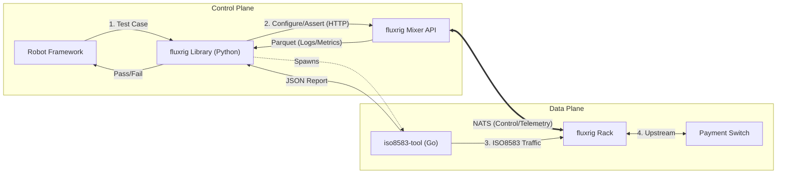

# Robot Framework reference

**fluxrig** integrates with **[Robot Framework](https://robotframework.org/)** to enable keyword-driven Acceptance Testing. This allows QA engineers, Product Owners, and Developers to define test scenarios in simple English without needing to write Go code.

> [!IMPORTANT]
> This integration provides a foundation: the same keywords and libraries used to validate the **fluxrig** platform are available for users to build their own end-to-end simulation and validation environments.

> [!NOTE]
> For the philosophy behind our testing approach, see the [Testing & Simulation Architecture](../architecture/testing_simulation.md).

## Integration architecture

The **fluxrig** integration is split into specialized Python libraries (under `test/robot/lib/`) that orchestrate the test environment:

1.  **`fluxrigLibrary`**: Manages infrastructure lifecycle (Start Mixer / Start Rack, enrollment and adoption) and health checks.
2.  **`ISO8583Library`**: Load generation and protocol assertion, plus scheme/endpoint simulators (`start_load_generator`, `start_echo_server`).
3.  **`ToxiProxyLibrary`**: Network fault injection (latency, disconnects) for resilience and failover tests.
4.  **`NATSLibrary`**: Direct bus interaction for publishing/subscribing to `flux.msg.>` signals.
5.  **`TelemetryLibrary`**: Asserts emitted telemetry (Parquet/DuckDB) matches expected behavior.

1.  **Orchestration**: Robot Framework communicates with the **Mixer API** (HTTP) to configure the environment and assert state.
2.  **Telemetry verification**: The library reads **Parquet/DuckDB** data generated by the Mixer to verify that system behavior matches expectations (e.g., specific logs or metrics).
3.  **Traffic generation**: For payments, it spawns `iso8583-tool` (Go) to drive traffic.



## Standard libraries and keywords

The **fluxrig** test suites leverage these specialized Python libraries. To use them in a test suite, include the ones you need in the `*** Settings ***` section:

```robot
*** Settings ***
Library    fluxrigLibrary
Library    ISO8583Library
Library    NATSLibrary
```

These libraries provide the following high-level keywords:

## Messaging

| Keyword | Library | Description |
| :--- | :--- | :--- |
| `Run Native Load Test` | `ISO8583Library` | Spawns `iso8583-tool` (Go) for load generation. |
| `Publish Flux Msg` | `NATSLibrary` | Publishes a dictionary as a CBOR-encoded fluxMsg to NATS. |
| `Subscribe And Expect` | `NATSLibrary` | Blocks until a specific key/value pair is received or timeout occurs. |

## Assertions

| Keyword | Arguments | Description |
| :--- | :--- | :--- |
| `Assert Success Rate Above` | `report`, `percentage` | Verifies the success rate from the load report. |
| `Assert Latency P99 Below` | `report`, `ms` | Verifies P99 latency is below threshold. |

## Usage examples

## Performance load test (baseline)

This example demonstrates how to orchestrate a load test:

1.  **Configure**: Set up the mixer/rack.
2.  **Execute**: Run the native Go load generator.
3.  **Verify**: Assert performance metrics (latency, success rate).

```robot
*** Test Cases ***
Baseline Load Test (100 TPS)
    [Documentation]    Runs a 10s load test at 100 TPS.

    # 1. Start Environment
    Start Mixer    config_file=mixer.toml    work_dir=${WORK_DIR}
    Start Rack     config_file=rack.toml     work_dir=${WORK_DIR}
    Wait For Rack Registration    mixer_port=8090    rack_name=node-1

    # 2. Run Load (Go Tool)
    # Spawns 'iso8583-tool' process
    ${report}=    Run Native Load Test
    ...    target=localhost:8583
    ...    rate=100
    ...    duration=10s

    # 3. Validation
    Assert Success Rate Above    ${report}    99.9
    Assert Latency P99 Below     ${report}    100
```


## Standard ISO8583 test suites
The platform includes several pre-configured **Robot Framework** suites (available in the source `test/robot/suites/` directory) that serve as both validation for the platform and templates for user implementations:

| Suite | Focus | Key Scenarios |
| :--- | :--- | :--- |
| **`server_validation`** | Functional | Loopback validation, MTI routing, and **Header Preservation**. |
| **`server_staged_load`** | Performance | Baseline (100 TPS) vs. Stress (1000+ TPS) performance curves. |
| **`resilience`** | Chaos | Node failover, NATS link severance, and connection recovery. |
| **`coatcheck_loop`** | Pattern | Asymmetrical request/response routing via the **Coat Check** pattern. |

---

## Running tests

Robot tests are executed using the standard `robot` CLI or via our Make wrapper:

```bash
# Run all tests
make test-acceptance

# Run specific suite
robot -d results/ tests/acceptance/payments.robot
```

## CI/CD integration
Because the execution outputs a standard `output.xml` result file in the `results/` directory, the **fluxrig** acceptance tests programmatically integrate with major CI/CD pipelines (Jenkins, GitLab CI, GitHub Actions) using standard Robot Framework plugins, generating interactive HTML reports and historical trends.