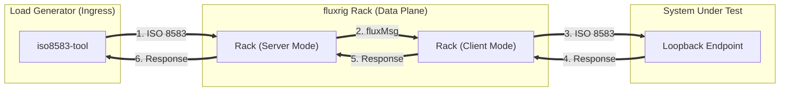
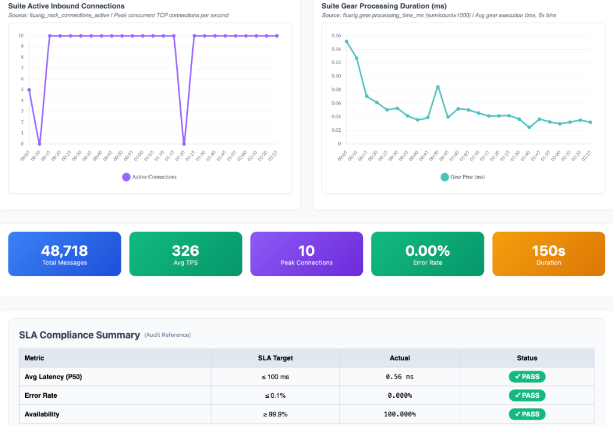
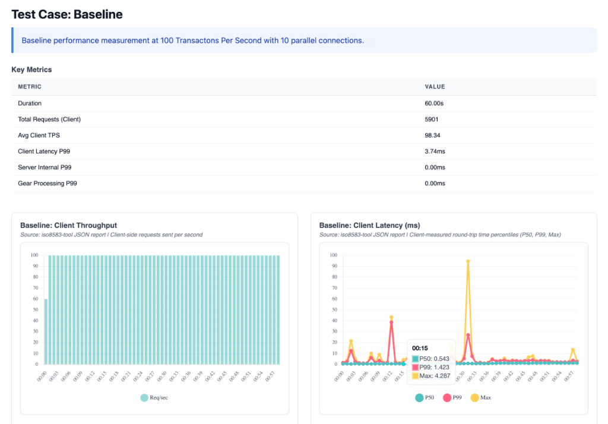

# Robot Framework Testing

This tutorial guides you through using the **fluxrig** integration for **[Robot Framework](https://robotframework.org/)** to build a complete validation and performance rig for mission-critical signal processing.

> [!NOTE]
> **Universal Applicability**: While this tutorial uses **ISO 8583** as the high-fidelity technical example, the **`FluxRigLibrary`** is a universal verification harness. It can be used to orchestrate and validate any gear, protocol, or business logic orchestrated by the platform.

In the **fluxrig** ecosystem, testing is not an afterthoughtit is a core engineering discipline. A **Verification Suite** is an automated playbook that:

1.  **Orchestrates**: Launches the Mixer, Racks, and virtual Gears in a clean, isolated environment.
2.  **Exercises**: Drives real protocol traffic (like ISO 8583) through the setup.
3.  **Validates**: Asserts that the system meets sub-millisecond latency SLAs and functional correctness.

To guarantee technical fidelity, every code snippet in this tutorial is identical to the production source code found in `test/robot/suites/iso8583/server_validation.robot`.

---

## Source directory orientation

Before running the suite, it helps to understand the standard layout in the `fluxrig` source repository:

```text
test/robot/
├── resources/
│   └── common.resource       #  Shared Keywords (Mixer/Rack Lifecycle)
└── suites/
    └── iso8583/
        ├── configs/          #  fluxrig.toml and mixer.toml templates
        ├── scenario_server_loopback.yaml  #  Message routing rules
        └── server_validation.robot        #  The actual test suite
```

---

## Signal verification topology

The standard ISO 8583 suite uses a loopback topology to verify system integrity without external dependencies:



---

## Step 1: Setting up the suite

Every Robot suite begins with a `*** Settings ***` block. We use the **`FluxRigLibrary`** to manage the lifecycle of our components.

```robot
# test/robot/suites/iso8583/server_validation.robot
*** Settings ***
Documentation     ISO8583 Server Mode Validation (Internal Loopback)
...               Validates fluxrig in Server Mode by forwarding traffic back to the source.
...               Topology: [Load Gen] -> [Server Gear] -> (Loopback) -> [Server Gear] -> [Load Gen]
Resource          ../../resources/common.resource
Library           FluxRigLibrary                #  Core bridge to fluxrig
Library           Collections                   #  Standard Robot Library
Suite Setup       Initialize Server Suite    ${CURDIR}  #  Clean-room orchestration
Suite Teardown    Teardown Server Suite         #  Resource recovery
```

> [!TIP]
> **Institutional Security**: Under the hood, the suite execution keyword `Generate Cluster Key` bootstraps the internal PKI required for our **mTLS Snake Tunnel** security posture. This ensures we are testing a system-hardened environment from Step 1.

---

## Step 2: Functional verification tests

Functional tests verify that specific protocol rules (MTI conversion, Field Mapping) are correctly enforced.

```robot
Server Loopback Validation (Functional)
    [Documentation]    Verifies Server Mode logic and Header Preservation via loopback.
    [Tags]    validation    server
    #  Start a low-volume load and extract a local report
    ${report}=    Run Native Load Test
    ...    target=${ISO_HOST}:${ISO_PORT}
    ...    concurrency=5        #  Five persistent connections
    ...    rate=10               #  Low volume for logic verification
    ...    duration=5s
    ...    report_file=${WORK_DIR}/r_server_valid.json
    ...    warmup=1s             #  Brief warm-up period to stabilize GC
    
    #  Assert absolute transactional integrity
    Assert Response Rate Above   ${report}    100.0  
    Assert Latency P99 Below     ${report}    50.0   

    # Record result for the institutional dashboard
    Record Performance Result  ${WORK_DIR}/r_server_valid.json
    ...    name=Functional    
    ...    description=Functional validation verifiying MTI 0800 loopback with BCD encoding.
    ...    work_dir=${WORK_DIR}
```

---

## Step 3: Performance benchmarking

To identify saturation points, we use **Load Tests** with higher volumes to determine the exact performance "Knee" of the environment.

```robot
Server Loopback Performance (Baseline 100 TPS)
    [Documentation]    Baseline performance test at 100 TPS.
    [Tags]    perf    baseline
    ${report}=    Run Native Load Test
    ...    target=${ISO_HOST}:${ISO_PORT}
    ...    concurrency=10
    ...    rate=100
    ...    duration=60s
    ...    report_file=${WORK_DIR}/r_server_100tps.json
    ...    warmup=2s

    Assert Response Rate Above   ${report}    95.0
    Assert Latency P99 Below     ${report}    100.0
```

---

## Step 4: Analyzing high-fidelity results

The **`FluxRigLibrary`** automatically renders an interactive dashboard with real-time telemetry extraction.

| System Telemetry & Health | Baseline Performance (100 TPS) |
| :--- | :--- |
|  |  |
| *Deep dive into Rack vs. Gear vs. NATS overhead.* | *SLA verification and total message volume at standard load.* |

*   **Microsecond Precision**: You might see `0.00ms` for gear latency. This is an **SRE Badge of Honor**, it indicates the logic was executed within a single Go scheduler cycle, faster than the microsecond resolution of the OTel instrumentation.
*   **System Telemetry**: Use the dashboard to isolate protocol jitter from networking overhead.

---

## Step 5: How to run the suite

To run this verification suite locally, navigate to the `test/robot` directory in the `fluxrig` source and use the standard Robot Framework CLI:

```bash
# From ~/git/fluxrig/test/robot
$ robot suites/iso8583/server_validation.robot
```

The system will automatically spawn the Mixer and Rack, execute the tests, and generate a final `log.html` and a specialized `suite_performance_summary.html` with your high-fidelity metrics.

---

## Step 6: CI/CD Quality Gates

In production environments, these Robot suites serve as **Quality Gates** in the CI/CD pipeline. A single performance regression (e.g., P99 drifting from 0.8ms to 1.5ms) should block a release.

```bash
# Run the suite and fail the pipeline if a test fails
$ robot --variable ISO_HOST:test-env-01 suites/iso8583/server_validation.robot
$ if [ $? -ne 0 ]; then echo "Quality Gate Failed"; exit 1; fi
```

> [!WARNING]
> **Industrial Warning: Scheduler Jitter**
> 
> While the target for P99 is often **`< 1ms`**, results on shared hardware will always show jitter. For authoritative **ISO 8583** benchmarks, the **Rack** and **Mixer** must be pinned to isolated CPU cores on a Real-Time Linux kernel to isolate protocol latency from OS scheduler noise.
