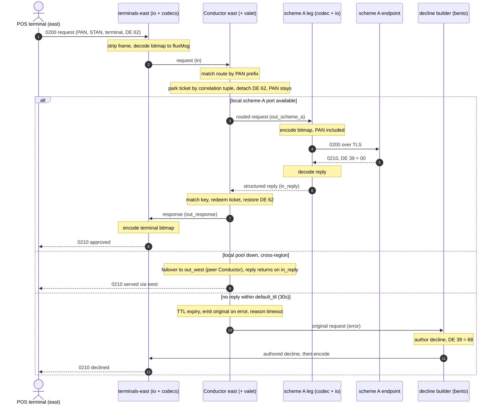
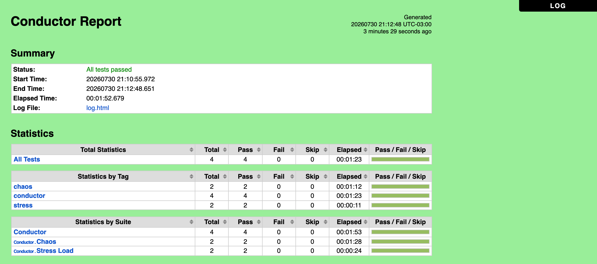

<!-- Copyright (c) 2026 JAAB Tech SAS, Uruguay All Rights Reserved -->
<!-- See https://jaab.tech -->

# Building a multi-region payment switch

> This switch is built on the Conductor gear: it routes each authorization, correlates the reply, and surfaces timeouts. The design is validated end-to-end by the payment-switch e2e (BIN routing: approve/decline/timeout) and the Conductor Robot suites (concurrent multi-source load, and Toxiproxy-driven link/terminal chaos). Cross-region routing uses the same primitives as the single-region path (a destination wired to a peer Conductor over the Snake). The full results, environment, and caveats are in [Validation](#validation).

This tutorial builds a two-region payment switch: POS terminals and scheme uplinks (two independent card schemes, scheme A and scheme B) exist in both regions, and any terminal can reach any uplink. Traffic prefers its local region and fails over across regions when a scheme link degrades.

## What you will build

Two Racks, one per region (east and west). Region east is the main region: it also hosts the Mixer (control plane, with the embedded Snake/NATS hub that Racks connect to outbound). Each Rack hosts the full stack: terminal-facing ingress, a Conductor, and its scheme uplinks: one per scheme in west, while east runs two scheme A uplinks balanced by in-flight load (`least_loaded`). The Conductors are the switching layer: each one routes to its local uplinks (same Rack), and to the remote region's uplinks over the Snake (NATS) when local links are down or the strategy prefers them.

POS terminals and scheme endpoints are external systems: they live in the region but outside the Rack, and each connects to exactly one I/O gear over a single bidirectional socket (drawn double-headed). Everything inside a Rack is unidirectional wires; request and reply wires are shown separately.

<LikeC4 project="payment-switch" view="index" height={560} />

Both diagrams are generated from the [scenario](#the-scenario) below and are interactive: hover a node for its description, drag to pan, scroll to zoom, and open a node to focus its neighbours. The overview groups the two regions; the region detail expands `rack-east` down to its individual gears. Every internal edge is one unidirectional wire from the `wires:` section (region west is identical); every double-headed connection at the edge is one bidirectional TCP socket owned by an I/O gear.

<LikeC4 project="payment-switch" view="of_rack_east" height={560} />

The exception path runs through the Conductor's `error` port. The Conductor itself never authors a response: on any abnormal outcome (no matching route, no available destination, timeout, or a reply with no open ticket) it emits the original structured message on `error`, annotated with `error.reason`, and a downstream gear, here a small `bento` decline builder, authors the terminal-facing decline (e.g. an ISO response with code `91`/`68`). That authored message re-enters the same response encoder as the happy-path response, so both reach the terminal by the same wire.

The scheme B leg is identical: each leg owns its codec pair (encode toward its scheme, decode from it), because in a real deployment each scheme speaks its own dialect and loads its own spec. Both legs' decoders deliver into the same Conductor `in_reply` port: multiple wires into one input port merge safely (fan-in), whereas one output port wired to several inputs would broadcast, which is why the request side must be per-leg too. The terminal side is the mirror argument: all responses head to a single terminal dialect, so one response encoder per region suffices. The Conductor's ports frame the groups: requests enter on `in`, decoded replies return on `in_reply`, and its outputs (`out_scheme_a`, `out_scheme_a2`, `out_scheme_b`, `out_response`, the `error` port for abnormal outcomes, the cross-region request port `out_west` and the reply-home port `out_response_west`) each feed exactly one destination. Note there is no special "peer" port kind: `out_west` is an ordinary destination that happens to be wired to another Conductor. Every socket is double-headed and owned by one I/O gear; every internal arrow is one unidirectional wire, and the Conductor only ever handles structured messages: replies are decoded before reaching it and responses re-encoded after it.

Any-to-any coverage falls out of this topology:

| Traffic | Path |
|:---|:---|
| Terminal (east) → scheme uplink (east) | Conductor east → local uplink (same Rack) |
| Terminal (east) → scheme uplink (west) | Conductor east → `out_west` → Conductor west → local uplink → response home via `out_response_east` |
| Terminal (west) → scheme uplink (west) | Conductor west → local uplink |
| Terminal (west) → scheme uplink (east) | Conductor west → `out_east` → Conductor east → local uplink → response home via `out_response_west` |

Two design rules make this correct:

1. A Conductor only drives uplinks on its own Rack. The Conductor↔uplink hop must stay on the same Rack; cross-region traffic goes Conductor-to-Conductor over the Snake, never Conductor-to-remote-socket. This keeps the latency-critical socket hop local, and is also what lets the Conductor sense each uplink's link-state directly. (An in-process fast lane for that local hop is a roadmap optimization; today it uses the standard transport.)
2. Each cross-region hop is an ordinary ingress/egress pair. When east routes to west, the request carries east's return context in-band, east's `origin: "east"` config stamps `conductor.origin: east` into the outbound metadata; west treats it like any local request, parks its own ticket for its uplink leg, and once it has the reply sees the stamp in that ticket's return context and routes the finished response back on `out_response_east`, arriving at east's `in_reply`, where east redeems the ticket it parked when it forwarded. No shared ticket store is required: correlation is local to each Conductor by default (the `store` strategy can change that, see the [Conductor reference](../reference/gears/conductor.md#ticket-store-strategy)). The in-band context is internal and is never sent to a scheme.

## Prerequisites

This tutorial composes the full stack across two regions, so it assumes the single-Rack fundamentals. Work through the [ISO 8583 robot suite](iso8583_robot_suite.md) first: it covers the ISO 8583 request/response loop and the test harness this switch builds on. Then:

*   A running Mixer, deployed in the main region (east in this tutorial) and reachable from both regions (see the [quickstart](quickstart.md)).
*   Two Racks enrolled and adopted: `rack-east`, `rack-west` (one per region, connected outbound to the Mixer over mTLS).
*   An ISO 8583 spec file for your message format (see the [ISO 8583 SDL reference](../reference/specs/iso8583_sdl.md)). This tutorial uses `specs/switch_v87.yaml` for both decode and encode.
*   Scheme connectivity from each region: one endpoint per scheme (host, port, TLS material). Placeholders are used below.

*   The full Rack binary (`make build`), not the lean `-tags nobento` variant. This scenario authors its DE 39 declines with a [`bento`](../reference/gears/bento.md) gear on the `error` path, so a lean Rack rejects it at activation with `unknown gear type: bento`. See [Rack build variants](../reference/tech_stack.md#rack-build-variants).

No external brokers, sidecars, or databases are required: transport, correlation state, and telemetry are embedded.

## The scenario

The complete scenario is also a runnable file: [`examples/scenarios/payment_switch_two_regions.yaml`](https://github.com/jaab-tech/fluxrig/blob/main/examples/scenarios/payment_switch_two_regions.yaml). The two interactive diagrams above are generated from it with `fluxrig scenario viz`, so they cannot drift from the wiring shown here.

From the Rack's point of view the two regions are nearly symmetric: same stack shape, same wiring pattern; besides names and endpoints, the one structural difference is that east runs a second scheme A uplink (a local round-robin pool). The regions themselves are not symmetric: the main region (east) also hosts the Mixer, but the Mixer is infrastructure, not part of the scenario: no gear below refers to it, and the same scenario would apply unchanged if the Mixer moved.

> [!NOTE]
> Every `wires:` entry below is unidirectional (fluxrig wires carry messages one way only). The bidirectional TCP sockets exist solely at the outer edge of the `io_iso8583` gears: toward the terminals and toward the schemes. That is why each request/response leg needs a pair of wires: one carrying requests forward, one carrying replies back.

```yaml
meta:
  name: "payment_switch_two_regions"
  version: "1.0.0"

racks:
  - name: "rack-east"
    labels:
      region: "east"
  - name: "rack-west"
    labels:
      region: "west"

gears:
  # ───────────────────────── Region east ─────────────────────────
  - name: "terminals-east"
    type: "io_iso8583"
    deploy: "rack-east"
    config:
      mode: "server"
      bind: ":8583"
      frame_length_size: 2
      frame_length_endian: "big"
      encoding: "ascii"

  - name: "decode-east"
    type: "codec_iso8583"
    deploy: "rack-east"
    config:
      spec_path: "specs/switch_v87.yaml"
      direction: "decode"
      on_error: "reject"

  - name: "conductor-east"
    type: "conductor"
    deploy: "rack-east"
    config:
      # This Conductor's name in the mesh. Stamped in-band (conductor.origin)
      # on every routed request so a peer knows to return the finished
      # response on out_response_east.
      origin: "east"
      # Correlation engine (valet). One store per Conductor.
      valet:
        store: "memory"          # memory | local_durable [Roadmap] | shared
        default_ttl: "30s"       # open-ticket timeout (transaction deadline)
        retain_after_close: "5s" # replay window for a lost-response retransmission
      # The tuple that identifies one transaction (never a bare STAN, which wraps
      # within a day): STAN + transmission date/time + acquirer + terminal.
      correlation_key: ["iso8583.field.11", "iso8583.field.7", "iso8583.field.32", "iso8583.field.41"]
      # Optional field parking: keep specific fields OFF a chosen leg and restore
      # them on the reply. Demonstrated with an internal routing hint, NOT the
      # PAN (a switch must send the PAN to the scheme to authorize). Parking is
      # not tokenization (surrogate substitution is a separate, future gear).
      park_fields: ["iso8583.field.62"]        # internal acquirer routing hint (private field)
      # A destination is just an output port: local uplink legs and remote
      # Conductors are addressed identically (there is no "peer" port kind). Each
      # route picks its destination with a TREE: failover | round_robin |
      # least_loaded compose freely; leaves are output ports. `out_west` is wired
      # (below) to conductor-west.in, so "cross-region" is a wiring fact, not a
      # config flag.
      routes:
        - name: "scheme-a"
          match: { field: "iso8583.field.2", prefix: "4" }    # PAN range handled by scheme A
          destination:
            failover:
              - least_loaded: ["out_scheme_a", "out_scheme_a2"]  # local pool
              - "out_west"                                       # cross-region
        - name: "scheme-b"
          match: { field: "iso8583.field.2", prefix: "5" }    # PAN range handled by scheme B
          destination:
            failover:
              - "out_scheme_b"
              - "out_west"

  - name: "encode-scheme-a-east"
    type: "codec_iso8583"
    deploy: "rack-east"
    config: { spec_path: "specs/switch_v87.yaml", direction: "encode", on_error: "reject" }

  - name: "uplink-scheme-a-east"
    type: "io_iso8583"
    deploy: "rack-east"
    config:
      mode: "client"
      connect: "scheme-a.east.example:9001"
      frame_length_size: 2
      frame_length_endian: "big"
      encoding: "ascii"
      reconnect_wait: "2s"
      tls:                                   # native ISO 8583 TLS/mTLS (implemented)
        enabled: true
        cert_file: "/etc/fluxrig/tls/scheme-a-east.crt"
        key_file: "/etc/fluxrig/tls/scheme-a-east.key"
        ca_file: "/etc/fluxrig/tls/scheme-a-ca.pem"

  # Second scheme A connection (same scheme, second access point): its own
  # encode+io leg, same client identity, same dialect.
  - name: "encode-scheme-a2-east"
    type: "codec_iso8583"
    deploy: "rack-east"
    config: { spec_path: "specs/switch_v87.yaml", direction: "encode", on_error: "reject" }

  - name: "uplink-scheme-a2-east"
    type: "io_iso8583"
    deploy: "rack-east"
    config:
      mode: "client"
      connect: "scheme-a-2.east.example:9001"
      frame_length_size: 2
      frame_length_endian: "big"
      encoding: "ascii"
      reconnect_wait: "2s"
      tls:
        enabled: true
        cert_file: "/etc/fluxrig/tls/scheme-a-east.crt"
        key_file: "/etc/fluxrig/tls/scheme-a-east.key"
        ca_file: "/etc/fluxrig/tls/scheme-a-ca.pem"

  - name: "encode-scheme-b-east"
    type: "codec_iso8583"
    deploy: "rack-east"
    config: { spec_path: "specs/switch_v87.yaml", direction: "encode", on_error: "reject" }

  - name: "uplink-scheme-b-east"
    type: "io_iso8583"
    deploy: "rack-east"
    config:
      mode: "client"
      connect: "scheme-b.east.example:9002"
      tpdu_enabled: true                     # scheme B frames with a TPDU header
      frame_length_size: 2
      frame_length_endian: "big"
      encoding: "bcd"                        # and BCD encoding
      reconnect_wait: "2s"
      tls:
        enabled: true
        cert_file: "/etc/fluxrig/tls/scheme-b-east.crt"
        key_file: "/etc/fluxrig/tls/scheme-b-east.key"
        ca_file: "/etc/fluxrig/tls/scheme-b-ca.pem"

  # Reply-path codecs, one per leg: each scheme speaks its own dialect, so each
  # leg owns its decoder (this tutorial reuses one spec for simplicity; in
  # production each leg loads its scheme's spec). Responses to the terminals
  # share one encoder: there is only one terminal dialect.
  - name: "decode-scheme-a-east"
    type: "codec_iso8583"
    deploy: "rack-east"
    config: { spec_path: "specs/switch_v87.yaml", direction: "decode", on_error: "reject" }

  - name: "decode-scheme-b-east"
    type: "codec_iso8583"
    deploy: "rack-east"
    config: { spec_path: "specs/switch_v87.yaml", direction: "decode", on_error: "reject" }

  - name: "encode-replies-east"
    type: "codec_iso8583"
    deploy: "rack-east"
    config: { spec_path: "specs/switch_v87.yaml", direction: "encode", on_error: "reject" }

  # Exception path: the Conductor emits the ORIGINAL structured message on its
  # `error` port (never an authored message), with the reason in metadata
  # (error.reason). This bento gear is where the decline is authored: an inline
  # Bloblang mapping echoes the request, flips the MTI to its response value,
  # and sets DE39, then hands the result to the same reply encoder as the happy
  # path. (Bento mappings are inline; there is no external mapping file.)
  - name: "decline-builder-east"
    type: "bento"
    deploy: "rack-east"
    ports:
      inputs: ["in"]
      outputs: ["out"]
    config:
      bento:
        pipeline:
          processors:
            - mapping: |
                # `this` is the original structured request the Conductor parked;
                # meta("error.reason") is timeout|no_destination|no_route|no_key|
                # unmatched_reply; unlisted reasons fall to the default branch below.
                root = this
                # Response MTI = request MTI with the message-class bit set.
                root.mti = match this.mti {
                  "0100" => "0110"    # authorization
                  "0200" => "0210"    # financial
                  "0800" => "0810"    # network management
                  _      => this.mti
                }
                # DE39 (response code) chosen from why the switch could not complete.
                root."39" = match meta("error.reason") {
                  "timeout"        => "68"   # response received too late
                  "no_destination" => "91"   # issuer / switch inoperative
                  "no_route"       => "30"   # format error (no route)
                  _                => "96"   # system malfunction
                }

  # ───────────────────────── Region west ─────────────────────────
  - name: "terminals-west"
    type: "io_iso8583"
    deploy: "rack-west"
    config:
      mode: "server"
      bind: ":8583"
      frame_length_size: 2
      frame_length_endian: "big"
      encoding: "ascii"

  - name: "decode-west"
    type: "codec_iso8583"
    deploy: "rack-west"
    config:
      spec_path: "specs/switch_v87.yaml"
      direction: "decode"
      on_error: "reject"

  - name: "conductor-west"
    type: "conductor"
    deploy: "rack-west"
    config:
      origin: "west"
      valet:
        store: "memory"          # independent local store; NOT a shared bucket
        default_ttl: "30s"
        retain_after_close: "5s"
      correlation_key: ["iso8583.field.11", "iso8583.field.7", "iso8583.field.32", "iso8583.field.41"]
      park_fields: ["iso8583.field.62"]        # same internal routing hint, non-PAN
      routes:
        - name: "scheme-a"
          match: { field: "iso8583.field.2", prefix: "4" }
          destination:
            failover:
              - "out_scheme_a"
              - "out_east"
        - name: "scheme-b"
          match: { field: "iso8583.field.2", prefix: "5" }
          destination:
            failover:
              - "out_scheme_b"
              - "out_east"

  - name: "encode-scheme-a-west"
    type: "codec_iso8583"
    deploy: "rack-west"
    config: { spec_path: "specs/switch_v87.yaml", direction: "encode", on_error: "reject" }

  - name: "uplink-scheme-a-west"
    type: "io_iso8583"
    deploy: "rack-west"
    config:
      mode: "client"
      connect: "scheme-a.west.example:9001"
      frame_length_size: 2
      frame_length_endian: "big"
      encoding: "ascii"
      reconnect_wait: "2s"
      tls:
        enabled: true
        cert_file: "/etc/fluxrig/tls/scheme-a-west.crt"
        key_file: "/etc/fluxrig/tls/scheme-a-west.key"
        ca_file: "/etc/fluxrig/tls/scheme-a-ca.pem"

  - name: "encode-scheme-b-west"
    type: "codec_iso8583"
    deploy: "rack-west"
    config: { spec_path: "specs/switch_v87.yaml", direction: "encode", on_error: "reject" }

  - name: "uplink-scheme-b-west"
    type: "io_iso8583"
    deploy: "rack-west"
    config:
      mode: "client"
      connect: "scheme-b.west.example:9002"
      tpdu_enabled: true
      frame_length_size: 2
      frame_length_endian: "big"
      encoding: "bcd"
      reconnect_wait: "2s"
      tls:
        enabled: true
        cert_file: "/etc/fluxrig/tls/scheme-b-west.crt"
        key_file: "/etc/fluxrig/tls/scheme-b-west.key"
        ca_file: "/etc/fluxrig/tls/scheme-b-ca.pem"

  - name: "decode-scheme-a-west"
    type: "codec_iso8583"
    deploy: "rack-west"
    config: { spec_path: "specs/switch_v87.yaml", direction: "decode", on_error: "reject" }

  - name: "decode-scheme-b-west"
    type: "codec_iso8583"
    deploy: "rack-west"
    config: { spec_path: "specs/switch_v87.yaml", direction: "decode", on_error: "reject" }

  - name: "encode-replies-west"
    type: "codec_iso8583"
    deploy: "rack-west"
    config: { spec_path: "specs/switch_v87.yaml", direction: "encode", on_error: "reject" }

  - name: "decline-builder-west"
    type: "bento"
    deploy: "rack-west"
    ports:
      inputs: ["in"]
      outputs: ["out"]
    config:
      bento:
        pipeline:
          processors:
            - mapping: |
                # Identical decline mapping to decline-builder-east.
                root = this
                root.mti = match this.mti {
                  "0100" => "0110"
                  "0200" => "0210"
                  "0800" => "0810"
                  _      => this.mti
                }
                root."39" = match meta("error.reason") {
                  "timeout"        => "68"
                  "no_destination" => "91"
                  "no_route"       => "30"
                  _                => "96"
                }

wires:
  # ── Region east: ingress → decode → conductor ──
  - from: "terminals-east.out"
    to: "decode-east.in"
  - from: "decode-east.out"
    to: "conductor-east.in"

  # ── Region east: conductor → local uplinks (encode → io) ──
  - from: "conductor-east.out_scheme_a"
    to: "encode-scheme-a-east.in"
  - from: "encode-scheme-a-east.out"
    to: "uplink-scheme-a-east.in"

  - from: "conductor-east.out_scheme_a2"
    to: "encode-scheme-a2-east.in"
  - from: "encode-scheme-a2-east.out"
    to: "uplink-scheme-a2-east.in"

  - from: "conductor-east.out_scheme_b"
    to: "encode-scheme-b-east.in"
  - from: "encode-scheme-b-east.out"
    to: "uplink-scheme-b-east.in"

  # ── Region east: scheme replies → per-leg decode → conductor ──
  # (both decoders deliver into the same reply port: fan-in merges safely)
  - from: "uplink-scheme-a-east.out"
    to: "decode-scheme-a-east.in"
  - from: "uplink-scheme-a2-east.out"
    to: "decode-scheme-a-east.in"    # same dialect: both A-legs share the decoder
  - from: "decode-scheme-a-east.out"
    to: "conductor-east.in_reply"
  - from: "uplink-scheme-b-east.out"
    to: "decode-scheme-b-east.in"
  - from: "decode-scheme-b-east.out"
    to: "conductor-east.in_reply"

  # ── Region east: matched responses → encode → back to terminals ──
  - from: "conductor-east.out_response"
    to: "encode-replies-east.in"
  - from: "encode-replies-east.out"
    to: "terminals-east.in"

  # ── Region east: exceptions → decline builder → same reply encoder ──
  # The Conductor emits the original request on `error`; the builder authors
  # the decline, which merges into encode-replies-east (fan-in) alongside
  # the happy-path responses.
  - from: "conductor-east.error"
    to: "decline-builder-east.in"
  - from: "decline-builder-east.out"
    to: "encode-replies-east.in"

  # ── Region west: symmetric ──
  - from: "terminals-west.out"
    to: "decode-west.in"
  - from: "decode-west.out"
    to: "conductor-west.in"

  - from: "conductor-west.out_scheme_a"
    to: "encode-scheme-a-west.in"
  - from: "encode-scheme-a-west.out"
    to: "uplink-scheme-a-west.in"

  - from: "conductor-west.out_scheme_b"
    to: "encode-scheme-b-west.in"
  - from: "encode-scheme-b-west.out"
    to: "uplink-scheme-b-west.in"

  - from: "uplink-scheme-a-west.out"
    to: "decode-scheme-a-west.in"
  - from: "decode-scheme-a-west.out"
    to: "conductor-west.in_reply"
  - from: "uplink-scheme-b-west.out"
    to: "decode-scheme-b-west.in"
  - from: "decode-scheme-b-west.out"
    to: "conductor-west.in_reply"

  - from: "conductor-west.out_response"
    to: "encode-replies-west.in"
  - from: "encode-replies-west.out"
    to: "terminals-west.in"

  - from: "conductor-west.error"
    to: "decline-builder-west.in"
  - from: "decline-builder-west.out"
    to: "encode-replies-west.in"

  # ── Cross-region mesh (4 wires = 2 directions x request+response) ──
  # A peer is just a wired destination. Each direction needs a PAIR of wires,
  # because a fluxrig wire is one-way and a request/response exchange is two
  # flows: `out_<peer>` carries the request to the peer's `in`, and the peer
  # returns the finished response on `out_response_<origin>` to the origin's
  # `in_reply` (where the origin redeems the ticket it parked when it
  # forwarded). The response returns on `in_reply`, NOT `in`, so the Conductor
  # redeems it instead of re-routing it, and never has to parse the message to
  # tell a request from a reply. Two directions (east originates, west
  # originates) => 4 wires. They cross Racks, so they ride the Snake
  # automatically; no shared ticket store, each Conductor correlates locally.
  - from: "conductor-east.out_west"          # east forwards a request to west
    to: "conductor-west.in"
  - from: "conductor-west.out_response_east" # west returns the response to east
    to: "conductor-east.in_reply"

  - from: "conductor-west.out_east"          # west forwards a request to east
    to: "conductor-east.in"
  - from: "conductor-east.out_response_west" # east returns the response to west
    to: "conductor-west.in_reply"
```

## How a transaction flows

The sequence below shows one authorization through region east: the happy path, plus the two branches the Conductor takes when a local scheme link is down (cross-region failover) or the scheme does not answer in time (timeout to the decline builder). The prose after it walks each case in detail.



### Local case: terminal (east) pays through scheme A (east healthy)

1. **Ingress**: the POS sends a framed ISO 8583 request to `terminals-east` (`io_iso8583` server). The wire-level frame (length prefix, optional TPDU) is stripped and the raw message becomes a `fluxMsg`.
2. **Decode**: `decode-east` unpacks the bitmap into structured fields using the SDL spec.
3. **Conduct**: `conductor-east` matches the PAN prefix → route `scheme-a`, and parks a ticket in its local (`memory`) store, keyed by the `correlation_key` tuple, holding the return context (and, per `park_fields`, detaching the internal routing hint in DE 62 to restore on the reply). The PAN is not parked, it must reach the scheme to authorize. The route's destination tree evaluates top-down: `failover` tries its first child, the local `least_loaded` pool, which picks whichever port has fewer transactions in flight right now. This transaction draws `out_scheme_a`; if endpoint 1 slows down, new traffic drifts to `out_scheme_a2` automatically.
4. **Encode + egress**: `encode-scheme-a-east` packs the scheme-facing bitmap; `uplink-scheme-a-east` writes it to the scheme A socket over TLS. The Conductor→uplink hop never left the Rack.
5. **Reply**: scheme A answers on the same connection. `uplink-scheme-a-east` matches the wire response and emits the raw reply bitmap; the leg's own decoder, `decode-scheme-a-east`, unpacks it into structured fields and delivers it to `conductor-east.in_reply`. The Conductor matches the `correlation_key`, redeems the ticket, restores the parked routing hint (DE 62), and emits the completed response on `out_response`; `encode-replies-east` packs the terminal-facing bitmap, and `terminals-east` writes it back to the POS socket.
6. **Timeout**: if no reply arrives within `default_ttl` (30s), the valet daemon's TTL expiry fires. The Conductor does not author a response; it emits the original request on its `error` port with `error.reason: timeout` and the return context, so the decline builder can author a timeout decline (and any reversal, if configured) toward the terminal. The terminal never hangs.

### Exception cases: how errors surface

The Conductor routes and correlates; it does not author messages. Whenever it cannot complete the happy path it emits the *original* structured message on the `error` port, annotated with `error.reason`, and leaves authoring the customer-facing decline to a downstream gear (the `decline-builder-*` bento above). Five reasons can appear:

| `error.reason` | When | What the message carries |
|:---|:---|:---|
| `no_route` | No `routes` entry matches the request (e.g. an unhandled PAN range) | The original request; no ticket was parked |
| `no_destination` | A route matched but its entire destination tree is unavailable (all local ports down and every peer unreachable) | The original request; no ticket was parked |
| `no_key` | The request is missing one of the `correlation_key` fields, so it cannot be tracked (usually a codec/spec mismatch) | The original request; no ticket was parked |
| `timeout` | A ticket was parked but no reply arrived within `default_ttl` | The original request plus the parked return context |
| `unmatched_reply` | A reply arrived on `in_reply` with no open ticket, e.g. a late reply after the request already timed out | The reply message as received |

Because these leave on a dedicated port, error policy is a wiring decision, not gear-internal behavior: a decline builder authors terminal declines, and the same `error` stream can fan out to an alerting or reversal-initiating gear without touching the switch path. Keeping the Conductor out of the message-authoring business means the decline format, response codes, and reversal policy live in gears you can change independently of routing.

### Cross-region case: terminal (east), but scheme A east is down

Steps 1–2 identical. At step 3, `conductor-east` finds both local scheme A ports unavailable (`out_scheme_a` and `out_scheme_a2`: their uplinks are disconnected), so the entire `least_loaded` subtree is unavailable and `failover` moves to its next child, `out_west`. East parks its ticket locally (holding the return context) and emits the request, with that context carried in-band, on `out_west`. The wire crosses Racks, so it travels over the Snake to `conductor-west.in`.

Conductor west treats it as an ordinary inbound request: it parks its own ticket, routes to `out_scheme_a`, scheme A (west) answers and is decoded into west's `in_reply`, and west redeems its ticket. Because the request arrived from east (the in-band context says so), west routes the finished response on `out_response_east` → over the Snake → into `conductor-east.in_reply`. East matches the `correlation_key`, redeems the ticket it parked in step 3, restores the routing hint, and the response exits `out_response` toward the east terminals.

Two independent, local correlations chain here (east↔west and west↔uplink); neither Conductor needs to see the other's tickets. This is why `store: memory` suffices for the mesh, correlation is local to each Conductor, and the in-band context, which is internal routing state, is stripped before the request ever reaches a scheme.

## Dependencies and operational notes

*   **Embedded only**: with `store: memory` (this tutorial) correlation state is in-process, no external store at all. `store: shared` would use the Mixer's embedded NATS KV; either way there is no external dependency. The scheme sockets are plain TCP+TLS from the uplink gears.
*   **Latency discipline**: the Conductor and the uplink gears it drives MUST be co-deployed on the same Rack. Cross-region hops are explicit (an `out_<peer>` wired to another Conductor) and only taken when the destination tree reaches them (a local subtree drained), never accidentally.
*   **Scaling a region**: region east demonstrates the pattern: its scheme A route pools two local connections under a `least_loaded` node, each with its own encode+uplink leg, while both legs share `decode-scheme-a-east` (same dialect; fan-in into a decoder is safe just as it is into the Conductor's `in_reply` port). Adding a third connection is one more encode+uplink pair, one more leaf in the `least_loaded` node, and one reply wire into the shared decoder. The pool is defined by the scenario; each port maps to exactly one connection.
*   **Heterogeneous uplinks**: each uplink leg owns its own framing profile. In this scenario, scheme A uses plain 2-byte big-endian framing with ASCII encoding, while scheme B frames with a TPDU header and BCD encoding: the Conductor never sees either; framing is entirely the I/O gear's concern.
*   **Security**: the PAN flows to the scheme (a switch must authorize), so it is not parked; parking here is limited to a non-PAN internal hint (DE 62), reattached on the response. SAD (PIN block, track data, CVV) is never persisted. At-rest encryption of persistent ticket stores is not yet implemented, so cardholder-data flows use the default `memory` store, run hardened (memory locked against swap, core dumps disabled, buffers zeroized on release) so RAM contents can't leak via swap or a dump; see the [Conductor reference](../reference/gears/conductor.md#ticket-store-strategy). TLS material is per-uplink; the Rack↔Mixer transport is mTLS (Passport-based) as always.
*   **Observability**: each hop appends to the `fluxMsg` path; route decisions, destination-tree transitions, ticket ages, and per-destination availability are emitted as `flux.` metrics.
*   **Main-region isolation (west autonomy)**: if the main region becomes unreachable from west, `rack-west` keeps operating autonomously on its loaded scenario (Passport-cached offline startup; local pipelines run on the Rack, telemetry buffers in the WAL). With `store: memory`, west's correlation state is local, so local terminal→local-uplink traffic is fully unaffected, it does not depend on the main region at all. What degrades in this single-Mixer layout is only what physically transits the Mixer's Snake: the cross-region wires (`out_east` / `out_response_west`). So while main is unreachable, west loses the any-to-any mesh but keeps serving its own region. (Had we chosen `store: shared`, even local traffic would depend on the main-region KV, exactly the trade-off the store strategy exposes.)

> [!NOTE]
> The Mixer runs in the main region (east) and is not highly available: a single Mixer is the sole point of coordination for cross-region transit (and, under `store: shared`, for ticket state). A replicated Mixer/Snake deployment across regions is `[Roadmap]`; it would let the mesh survive the loss of any one region. Until then, losing the main region degrades only what transits it (the cross-region wires), as described above.

*   **Adding a third region**: the model is additive. Deploy the region's Rack and stack, wire a request pair and a response-home pair to each existing Conductor (`out_<new>` → `<new>.in`, and `<new>.out_response_<here>` → `<here>.in_reply`), and place `out_<new>` wherever it fits in each destination tree, e.g. balance across remote regions by nesting them under their own node, `- round_robin: ["out_west", "out_north"]` as a `failover` child. There is no `peers` list to maintain: a peer is defined entirely by its wires.
*   **Availability sensing**: see the [Conductor reference](../reference/gears/conductor.md#availability-sensing) for the full model: link-state signals from local uplink legs, peer heartbeats over a shared liveness channel, and a per-destination circuit breaker driven by ticket outcomes.

## Validation

The guarantees this tutorial relies on are proven by an automated harness, not asserted. Validation runs at two layers.

### Functional: the four routing outcomes

The `payment_switch` end-to-end test (`test/e2e/14_payment_switch`) drives a single-Rack switch built from the same gears used here (terminal I/O → decode → Conductor → per-scheme encode/uplink, with a Bento decline-builder on the `error` path) and asserts all four Conductor outcomes, selected by the PAN's BIN:

| BIN (DE 2 prefix) | Route | Outcome |
|:---|:---|:---|
| `4xxx` | scheme A | approve (0210, DE 39 = 00) |
| `5xxx` | scheme B | decline (0210, DE 39 = 05, from the scheme) |
| `6xxx` | scheme C (sinks the request) | timeout → `error` port → decline (DE 39 = 91) |
| `9xxx` | no match | no route → `error` port → decline (DE 39 = 05) |

### Non-functional: load and chaos

Two Robot Framework suites (`test/robot/suites/conductor/`) exercise the switch under concurrency and communication failure, validating the Conductor's core invariant, a reply always returns to the terminal that sent it (STAN echo, never cross-wired), and that faults degrade gracefully and stay isolated. Run them locally (not in CI; the chaos suite needs `toxiproxy-server` on `PATH`):

```sh
make test-robot-conductor
```

#### Results from a real run

The screenshot below is the report from one real run of `make test-robot-conductor`; the tables under it are the measured detail from that same run. Nothing here is a target: rerun the command to reproduce it on your own hardware.



*Robot Framework `report.html` from the run below: the full stress + chaos suite passing (4/4) on the environment noted at the end of this section.*

Stress (`stress_load.robot`), a mixed approve/decline load across schemes:

| Scenario | Terminals × txns | Total | Correlation | Achieved TPS | p99 latency |
|:---|:---|:---|:---|:---|:---|
| Mixed multi-scheme | 30 × 100 | 3,000 | 0 cross-wired · 0 failed (1,483 approve / 1,517 decline) | ~1,258 | ~103 ms |
| High concurrency | 60 × 150 | 9,000 | 0 cross-wired · 0 failed (4,515 / 4,485) | ~1,037 | ~110 ms |

Chaos (`chaos.robot`), with Toxiproxy in front of the links:

| Scenario | Result |
|:---|:---|
| Cut one scheme mid-load, then restore | Affected BIN (700 txns): 400 approvals (baseline + recovery) + 300 declines (during the cut), 0 dropped, 0 cross-wired. Unaffected BIN (700 txns): 700 approvals, fully isolated from the fault. |
| Terminal-link blip + reconnect | 800 txns across 4 terminals: 792 completed after reconnect, 8 in-flight lost to the reset (counted as dropped, never mis-delivered), 0 cross-wired, 0 malformed. |

Read together: under sustained multi-scheme load the switch never cross-wired a reply and never dropped a terminal; when a scheme link was cut, only the affected BIN degraded (to declines) while the other stayed healthy, and it recovered on restore; and a terminal-side disconnect was survived with reconnect and no mis-delivery.

#### Environment and caveats

- Environment: Apple M2 (8 cores), macOS (arm64), Go 1.26.4, single machine, commit `cac3432`, 2026-07-30. One Mixer plus one `rack-switch` Rack, embedded NATS (Snake) and OpenTelemetry active. Scheme hosts and POS terminals are `iso8583-tool` simulators.
- These are single-machine loopback runs against simulators: no real network latency, no upstream scheme processing time, and the load generator shares the CPU with the switch. Treat the throughput and latency as correctness-under-load evidence and a relative baseline on this hardware, not a production SLA or a capacity benchmark.
- Embedded observability is on (as in production), so the figures include telemetry overhead; achieved TPS is bounded by the single machine and the simulators, not by the switch alone.
- These suites validate the Conductor mechanics on a focused single-Rack harness. The multi-region topology built in this tutorial composes the same gear across Racks; cross-region transit over the Snake is covered separately by the cross-rack topology suite (`make test-robot-topology`).

## Current status

| Piece | Status |
|:---|:---|
| `io_iso8583` (server/client, framing, TPDU) | Available |
| `codec_iso8583` (SDL spec, encode/decode) | Available |
| Cross-rack wires over the Snake | Available |
| `bento` gear (decline authoring on the `error` path) | Available (requires the full Rack build, not `-tags nobento`) |
| `conductor` gear (routing, tickets, timeout, `error` port) | Available |
| `valet.store: memory` / `shared` | Available |
| `valet.store: local_durable` | [Roadmap] (later; durability tier) |
| At-rest encryption of persistent stores | [Roadmap] (use `memory` for regulated data until then) |
| Native TLS/mTLS on `io_iso8583` | Available |
| Conductor Robot Framework suite (stress + chaos) | Available (`make test-robot-conductor`) |
| Per-destination circuit breaker · peer heartbeats | [Roadmap] (availability-sensing refinements) |

## Related

- [Enriching an authorization with a network signal](roaming_enrichment.md) — the same switch position used to obtain a fact the message does not carry, under a deadline, with the Coat Check correlating the reply so the authorizer can be timed.
- [Mobile network signals in payments](../use_cases/mobile_network_signals.md) — why an issuer would want that, and what the operator APIs offer.

The Conductor generalizes the existing Coat Check gear (its correlation/TTL machinery is already in production) with routing and reply-return. Field parking stays a Conductor overlay; tokenization (surrogate substitution) will be a separate gear. Follow the changelog for further refinements.
