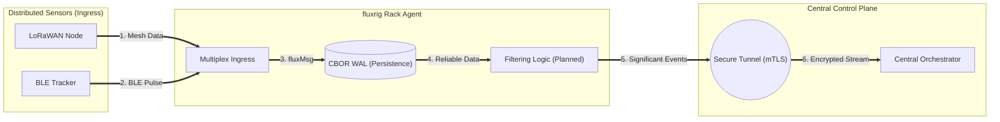

# Internet of Things (IoT)

# Internet of Things (IoT)

**fluxrig** is a high-performance distributed runtime designed to solve the critical challenges of asynchronous data acquisition across unreliable networks. It functions as an **IoT Edge Runtime**, enabling engineers to multiplex data from LoRaWAN, Zigbee, BLE, and CAN bus into a unified, cloud-native stream.

By shifting complexity to the **Distributed Node**, **fluxrig** allows organizations to reduce recurring carrier costs, maintain data integrity during backhaul outages, and retain full ownership of their telematic logic.

---

## Deployment patterns

Unlike monolithic IIoT gateways, **fluxrig** provides a flexible spectrum of operational patterns for high-density device orchestration.

### The autonomous field gateway
Ideal for disconnected environments (e.g., Cold Chain, AgTech), where the **Rack** acts as a high-reliability persistence node with deterministic finality.

*   **Deterministic Persistence**: Implements a high-concurrency **CBOR-encoded Binary WAL** (Write-Ahead Log) with **Encryption-at-Rest**. This ensures 100% data integrity during LTE or Satellite network dropouts.
*   **Edge Data Filtering**: Analyzing data locally at the source. By only transmitting "Significant Events" (e.g., Temperature Variance > 0.5C) and discarding redundant heartbeats, organizations can achieve up to a **95% reduction in recurring carrier costs**.

### The transparent asset proxy
A high-performance deployment model for individual telematic units or industrial vehicles.

*   **Sovereign Telemetry**: Use the **[Bento Gear](../reference/gears/bento.md)** to bridge proprietary CAN bus or Modbus registers directly to semantic `fluxMsg` events with minimal overhead.
*   **Zero Trust Identity**: Every asset operates with independent mTLS certificates, ensuring that a compromised peripheral cannot impact the wider fleet.

### The LPWAN consolidation hub
Manage high-density sensor arrays (Zigbee, LoRaWAN) using a multiplexing model for smart city environments.

*   **Telemetry Aggregation**: The hub collects data from thousands of low-power leaf nodes, flattens the telemetry into a unified schema, and flushes it to the Management Mixer via a secure mTLS tunnel.

---

## Visualization: The field gateway flow

### Step-by-step processing
1.  **Data Multiplexing (1-2)**: Heterogeneous data from mesh and trackers are ingested into the Rack agent.
2.  **Deterministic WAL (3)**: Every bit is anchored to the local immutable archive before any network processing occurs.
3.  **Autonomous Filtering (4-5)**: Redundant data is discarded locally; only high-value events enter the encrypted tunnel.
4.  **Sovereign Command (6)**: The central Mixer receives a clean, normalized, and secured stream for orchestration.

---

## Institutional permissive freedom

**fluxrig** is a platform for institutional builders provided under the **Apache 2.0** license.

Most IoT platforms enforce a "per-device" billing model that creates a "Success Tax" as your fleet scales. **fluxrig** offers:

*   **Royalty-Free Scaling**: Deploy across 10 or 10,000 nodes without increasing platform licensing overhead.
*   **SaaS Lock-in Hedge**: Maintain a sovereign data layer. By defining your normalization logic locally, you can pivot between cloud providers without rewriting your field infrastructure.

> [!TIP]
> **Verification Strategy**: For large-scale fleet deployments, use **Scenario-Driven Simulation** to verify that your Filtering Logic maintains data integrity across simulated network partitions.

---

## Implementation reference

| Gear | Function | Status |
| :--- | :--- | :--- |
| **[Bento](../reference/gears/bento.md)** | Universal Protocol Bridge (MQTT, CAN, etc.) | **Stable** |
| **[io_lorawan](../reference/gears/io_lorawan.md)** | Native LoRaWAN LNS Integration | **Planned** |
| **[Wasm Logic](../reference/gears/wasm_logic.md)** | Custom Parsing & Edge Filtering | **Planned** |

---

## Implementation reference

| Gear | Function | Status |
| :--- | :--- | :--- |
| **[Bento](../reference/gears/bento.md)** | Universal Protocol Bridge (MQTT, CAN, etc.) | **Stable** |
| **[io_lorawan](../reference/gears/io_lorawan.md)** | Native LoRaWAN LNS Integration | **Planned** |
| **[Wasm Logic](../reference/gears/wasm_logic.md)** | Custom Parsing & Edge Filtering | **Planned** |