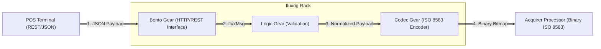

# Payment use cases

**fluxrig** is a high-performance transaction runtime designed for extreme architectural flexibility in modern financial environments. It functions as a **Payment Orchestration Runtime**, providing a unified data flow for normalizing, routing, and processing ISO 8583, ISO 20022, and other financial protocols.

Unlike rigid fixed-logic switches, **fluxrig** is a modular foundation. By composing specialized technical **Gears**, adopters can build anything from a passive transaction monitor to a high-throughput enterprise payment gateway.

---

## Operational patterns

Institutional payment infrastructure is categorized across a spectrum of operational patterns. **fluxrig** unifies these patterns into a single, cohesive architecture.

### Passive monitoring & observability
For environments where touching the transaction cycle is restricted, the **Rack** operates as a non-intrusive observer.

*   **Shadow Mirroring**: Duplicating production traffic to a parallel Rack for logic verification without impacting real-time money movement.
*   **Differential Integrity**: The system flags bugs by comparing existing switch responses against new logic results before a production cutover.

### Protocol orchestration gateway
As a high-performance orchestration gateway, **fluxrig** connects diverse systems, from cloud-native platforms to established financial networks.

*   **ISO 8583 Normalization**: The **[Codec Gear (ISO 8583)](../reference/gears/codec_iso8583.md)** performs deterministic translation of dense binary bitmaps into structured JSON/CBOR required by modern APIs.
*   **Sovereign Tokenization**: The Rack isolates sensitive data (PANs, CVVs) at the infrastructure boundary. The **[Token Gear (Coat Check)](../reference/gears/coatcheck.md)** performs deterministic tokenization, ensuring clear-text data never enters the centralized management layer.

### Active orchestration and switching
In this high-performance pattern, **fluxrig** acts as the deterministic engine of the payment flow, routing transactions between originators (ATMs/POS) and processors with sub-millisecond precision.

*   **Stand-in Processing (STIP)**: Composing a deterministic **[Logic Gear (STIP)](../reference/gears/wasm_logic.md)** allows the Rack to authorize transactions locally when the upstream host is unreachable, ensuring 100% mission-critical uptime.
*   **Request/Response Matching**: The **[Correlator Gear](../reference/gears/correlator.md)** matches inbound requests with asynchronous responses from schemes or APIs, ensuring absolute transactional integrity and enabling high-performance reconciliation in the immutable CBOR archives.

---

## Example: ISO 8583 acquisition gateway

This common scenario illustrates a modern transition: receiving standard Webhook/REST calls from a terminal and orchestrating them into a financial network.

### Step-by-step processing
1.  **REST Ingress**: The POS terminal sends a JSON payload. The **[Bento Gear](../reference/gears/bento.md)** acts as the high-performance HTTP server, mapping the request into an internal `fluxMsg`.
2.  **Business Logic**: The **Logic Gear** validates the transaction (e.g., checking minimum amount) and attaches routing metadata.
3.  **Protocol Encoding**: The **Codec Gear** encodes the semantic message into the precise ISO 8583 binary bitmap expected by the external processor.
4.  **Financial Egress**: The Rack transmits the encoded message to the Acquirer for authorization.

---

## Institutional permissive freedom

**fluxrig** is a platform for institutional builders provided under the **Apache 2.0** license.

In an industry dominated by proprietary "Black Box" switches and restrictive licenses, **fluxrig** offers true commercial agility. Our model ensures you can build proprietary, mission-critical logic without the risk of legal contamination or forced disclosure of your commercial intellectual property.

> [!TIP]
> **Verification Strategy**: Before production cutover, we recommend validating all ISO 8583 logic using the **[ISO 8583 Robot Suite](../tutorials/iso8583_robot_suite.md)**, a flagship verification suite for high-volume financial switching.